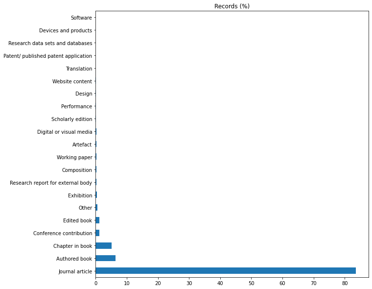
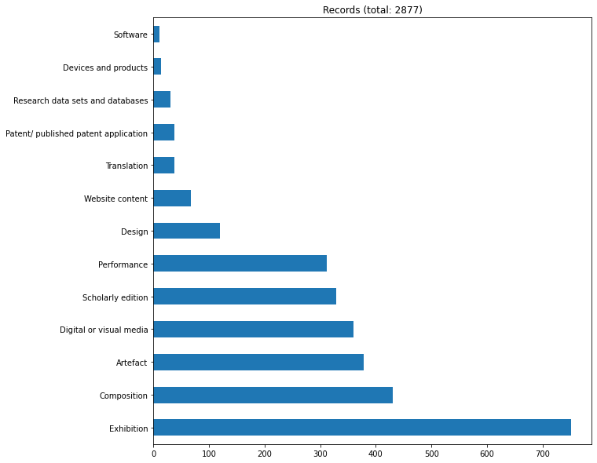

## Preliminary study of the REF 2021 submissions data

## Explore the `Outputs` table

    Read ../data/raw/extracted/Outputs.csv
    Preprocessed to 
    - replace missing values with 'Not specified - PP ADDED'
    
    Records      : 185354
    Institutions : 158
    Output types : 21
    Panels       : 4
    UOA          : 35
    
    All records
    -----------
    Output type name
                                          Records  Records (%)
    Output type name                                          
    Journal article                        154826    83.529894
    Authored book                           11801     6.366736
    Chapter in book                          9475     5.111840
    Conference contribution                  2272     1.225763
    Edited book                              2135     1.151850
    Other                                    1146     0.618276
    Exhibition                                751     0.405171
    Research report for external body         431     0.232528
    Composition                               430     0.231989
    Working paper                             390     0.210408
    Artefact                                  378     0.203934
    Digital or visual media                   360     0.194223
    Scholarly edition                         329     0.177498
    Performance                               312     0.168327
    Design                                    119     0.064201
    Website content                            67     0.036147
    Translation                                38     0.020501
    Patent/ published patent application       37     0.019962
    Research data sets and databases           31     0.016725
    Devices and products                       14     0.007553
    Software                                   11     0.005935

    

    

    
    Records without
    ['Journal article', 'Authored book', 'Chapter in book', 'Edited book', 'Conference contribution', 'Working paper', 'Research report for external body', 'Other', 'Not specified - PP ADDED']
    
    Output type name
                                          Records  Records (%)
    Output type name                                          
    Exhibition                                751    26.094510
    Composition                               430    14.940931
    Artefact                                  378    13.134121
    Digital or visual media                   360    12.508687
    Scholarly edition                         329    11.431550
    Performance                               312    10.840862
    Design                                    119     4.134816
    Website content                            67     2.328006
    Translation                                38     1.320361
    Patent/ published patent application       37     1.285615
    Research data sets and databases           31     1.077137
    Devices and products                       14     0.486449
    Software                                   11     0.382210

    

    

                                                                   Main panel name                       Unit of assessment name                                                                                                              Title
    Institution name                                                                                                                                                                                                                               
    University of Ulster                                       Arts and humanities  Art and Design: History, Practice and Theory                                                                                                    axial3d Insight
    Leeds Beckett University                                   Arts and humanities  Art and Design: History, Practice and Theory                                                                                                               CAGD
    University College London                                      Social sciences                                     Education                               EPPI-Reviewer: advanced software for systematic reviews, maps and evidence synthesis
    University of Exeter                                       Arts and humanities              Modern Languages and Linguistics                                                                                                    Hidden Florence
    The University of Manchester    Physical sciences, engineering and mathematics              Computer Science and Informatics                                                    JBMC: A Bounded Model Checking Tool for Verifying Java Bytecode
    University of Edinburgh         Physical sciences, engineering and mathematics              Computer Science and Informatics                                                                                 Met Office NERC Cloud model (MONC)
    Heriot-Watt University                                         Social sciences               Business and Management Studies  PDSLASSO & LASSOPACK : Stata module for post-selection and post-regularization OLS or IV estimation and inference
    University College London                                      Social sciences                                   Archaeology                                                   RCarbon: Methods for calibrating and analysing radiocarbon dates
    University of Exeter                                       Arts and humanities                                      Classics                                                                              Recogito Semantic Annotation platform
    University of Cambridge                                    Arts and humanities  Art and Design: History, Practice and Theory                                                             The Portable Antiquities Scheme's Database source code
    University of the Arts, London                             Arts and humanities  Art and Design: History, Practice and Theory                                                                                                      Wekinator 2.0

## Explore the `ResearchGroups` table

    Read ../data/raw/extracted/ResearchGroups.csv
    Preprocessed to 
    - replace missing values with Not specified - PP ADDED
    
    Records      : 2036
    Institutions : 83
    RGs          : 1788
    RG types     : 32
    Panels       : 4
    UOA          : 34
    
    Submissions by panel split by UOA
    ---------------------------------
    
    Panel A : Medicine, health and life sciences
                                                                Submissions
    Unit of assessment name                                                
    Allied Health Professions, Dentistry, Nursing and Pharmacy          214
    Psychology, Psychiatry and Neuroscience                             119
    Biological Sciences                                                 105
    Clinical Medicine                                                    95
    Public Health, Health Services and Primary Care                      57
    Agriculture, Food and Veterinary Sciences                            41
    
    Panel B : Physical sciences, engineering and mathematics
                                              Submissions
    Unit of assessment name                              
    Engineering                                       188
    Computer Science and Informatics                  140
    Mathematical Sciences                             130
    Physics                                           102
    Chemistry                                          64
    Earth Systems and Environmental Sciences           56
    
    Panel C : Social sciences
                                                      Submissions
    Unit of assessment name                                      
    Business and Management Studies                           109
    Geography and Environmental Studies                        61
    Social Work and Social Policy                              57
    Sport and Exercise Sciences, Leisure and Tourism           57
    Education                                                  52
    Politics and International Studies                         36
    Law                                                        28
    Sociology                                                  19
    Architecture, Built Environment and Planning               17
    Economics and Econometrics                                 15
    Archaeology                                                11
    Anthropology and Development Studies                        9
    
    Panel D : Arts and humanities
                                                                                   Submissions
    Unit of assessment name                                                                   
    Art and Design: History, Practice and Theory                                            80
    Music, Drama, Dance, Performing Arts, Film and Screen Studies                           34
    English Language and Literature                                                         31
    Communication, Cultural and Media Studies, Library and Information Management           27
    Area Studies                                                                            18
    History                                                                                 17
    Modern Languages and Linguistics                                                        15
    Theology and Religious Studies                                                          14
    Philosophy                                                                              12
    Classics                                                                                 6

