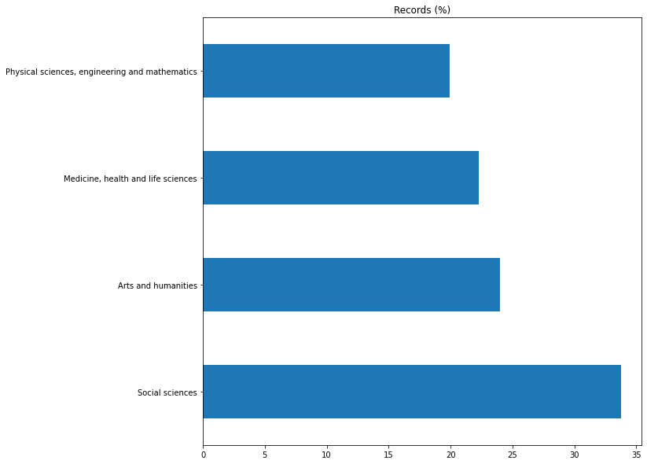

# Explorations of the REF 2021 submission data

Notes
- `Not specified - PP ADDED` is a category added during pre-processing to all string fields to replace missing values

## Environment statements

    Read data/processed/Outputs_ppreprocessed.csv.gz: 185353 records
    Read data/processed/ImpactCaseStudies_ppreprocessed.csv.gz: 6361 records
    
    Institutions - outputs : 157
    Institutions - impacts : 155
    Institution EV         : 143
    
    Institutions with...
    
    - outputs but no environment statements: 13
      ['AECC University College', 'Courtauld Institute of Art', 'Falmouth University', 'Glasgow School of Art', 'Harper Adams University', 'Rose Bruford College of Theatre and Performance', 'Royal College of Art(The)', 'Royal College of Music', 'Royal Northern College of Music', 'The Royal Academy of Music', 'Trinity Laban Conservatoire of Music and Dance', 'University College of Osteopathy (The)', 'University of the Arts, London']
    
    - environment statements but no outputs: 0
    
    - impacts but no environment statements: 13
      ['AECC University College', 'Courtauld Institute of Art', 'Falmouth University', 'Glasgow School of Art', 'Harper Adams University', 'Rose Bruford College of Theatre and Performance', 'Royal College of Art(The)', 'Royal College of Music', 'Royal Northern College of Music', 'The Royal Academy of Music', 'Trinity Laban Conservatoire of Music and Dance', 'University College of Osteopathy (The)', 'University of the Arts, London']
    
    - environment statements but no impacts: 2
      ['Institute of Zoology', 'SRUC']

## `Outputs` data

#### All records

    Read data/processed/Outputs_ppreprocessed.csv.gz: 185353 records
    
                                          Records  Records (%)
    Output type name                                          
    Journal article                        154826        83.53
    Authored book                           11801         6.37
    Chapter in book                          9475         5.11
    Conference contribution                  2272         1.23
    Edited book                              2135         1.15
    Other                                    1146         0.62
    Exhibition                                751         0.41
    Research report for external body         431         0.23
    Composition                               430         0.23
    Working paper                             390         0.21
    Artefact                                  378         0.20
    Digital or visual media                   360         0.19
    Scholarly edition                         329         0.18
    Performance                               312         0.17
    Design                                    119         0.06
    Website content                            67         0.04
    Translation                                38         0.02
    Patent/ published patent application       37         0.02
    Research data sets and databases           31         0.02
    Devices and products                       14         0.01
    Software                                   11         0.01

    

    

    
                                               Records  Records (%)
    Open access status                                             
    Compliant                                    85913        46.35
    Out of scope for open access requirements    58482        31.55
    Not specified - PP ADDED                     24173        13.04
    Technical exception                           4879         2.63
    Deposit exception                             4748         2.56
    Exception within 3 months of publication      2581         1.39
    Not compliant                                 2401         1.30
    Access exception                              1166         0.63
    Other exception                               1010         0.54

    

    

#### Records with `Output type` as _Software_

    Read data/processed/Outputs_ppreprocessed.csv.gz: 185353 records
    
    'Output type name' as 'Software' - 11 records
    
                              Records  Records (%)
    Open access status                            
    Not specified - PP ADDED       11       100.00
    
                              Records  Records (%)
    Interdisciplinary                             
    Not specified - PP ADDED        8        72.73
    Yes                             3        27.27
    
                                    Records  Records (%)
    Institution name                                    
    University College London             2        18.18
    University of Exeter                  2        18.18
    University of Ulster                  1         9.09
    Leeds Beckett University              1         9.09
    The University of Manchester          1         9.09
    University of Edinburgh               1         9.09
    Heriot-Watt University                1         9.09
    University of Cambridge               1         9.09
    University of the Arts, London        1         9.09
    
                                                    Records  Records (%)
    Main panel name                                                     
    Arts and humanities                                   6        54.55
    Social sciences                                       3        27.27
    Physical sciences, engineering and mathematics        2        18.18
    
                              Records  Records (%)
    Citations applicable                          
    Not specified - PP ADDED        9        81.82
    Yes                             2        18.18
    
                               Records  Records (%)
    Supplementary information                      
    Not specified - PP ADDED        11       100.00

#### Records with `computation` in `Title`

    Read data/processed/Outputs_ppreprocessed.csv.gz: 185353 records
    
    'Title' containing 'computation' - 596 records
    
                             Records  Records (%)
    Output type name                             
    Journal article              560        93.96
    Conference contribution       22         3.69
    Authored book                  8         1.34
    Chapter in book                4         0.67
    Edited book                    1         0.17
    Working paper                  1         0.17
    
                                               Records  Records (%)
    Open access status                                             
    Compliant                                      327        54.87
    Out of scope for open access requirements      200        33.56
    Not specified - PP ADDED                        20         3.36
    Deposit exception                               14         2.35
    Technical exception                             12         2.01
    Not compliant                                    7         1.17
    Exception within 3 months of publication         6         1.01
    Access exception                                 6         1.01
    Other exception                                  4         0.67
    
                              Records  Records (%)
    Interdisciplinary                             
    Not specified - PP ADDED      508        85.23
    Yes                            88        14.77
    
                                                    Records  Records (%)
    Main panel name                                                     
    Physical sciences, engineering and mathematics      413        69.30
    Medicine, health and life sciences                  100        16.78
    Social sciences                                      59         9.90
    Arts and humanities                                  24         4.03
    
                                                                       Records  Records (%)
    Institution name                                                                       
    University College London                                               41         6.88
    Imperial College of Science, Technology and Medicine                    25         4.19
    University of Oxford                                                    25         4.19
    University of Edinburgh                                                 25         4.19
    University of Cambridge                                                 24         4.03
    The University of Leeds                                                 22         3.69
    University of Bristol                                                   22         3.69
    The University of Bath                                                  14         2.35
    University of Southampton                                               14         2.35
    The University of Lancaster                                             13         2.18
    University of Glasgow                                                   13         2.18
    University of Newcastle upon Tyne                                       12         2.01
    University of Durham                                                    12         2.01
    Loughborough University                                                 10         1.68
    Cardiff University _ Prifysgol Caerdydd                                  9         1.51
    The University of Sheffield                                              9         1.51
    The University of Birmingham                                             9         1.51
    The University of Liverpool                                              8         1.34
    The University of Warwick                                                8         1.34
    University of Sussex                                                     8         1.34
    University of Nottingham, The                                            8         1.34
    University of Exeter                                                     8         1.34
    University of Ulster                                                     8         1.34
    University of Plymouth                                                   8         1.34
    The University of Surrey                                                 8         1.34
    The University of Huddersfield                                           7         1.17
    Brunel University London                                                 7         1.17
    The University of Manchester                                             7         1.17
    University of Hertfordshire                                              7         1.17
    Swansea University _ Prifysgol Abertawe                                  7         1.17
    The University of Kent                                                   7         1.17
    University of St Andrews                                                 6         1.01
    King's College London                                                    6         1.01
    Heriot-Watt University                                                   6         1.01
    Coventry University                                                      6         1.01
    Oxford Brookes University                                                6         1.01
    University of Greenwich                                                  6         1.01
    Goldsmiths' College                                                      6         1.01
    Birkbeck College                                                         5         0.84
    Queen's University of Belfast                                            5         0.84
    University of Strathclyde                                                5         0.84
    Queen Mary University of London                                          5         0.84
    University of the West of England, Bristol                               4         0.67
    Bournemouth University                                                   4         0.67
    Edinburgh Napier University                                              4         0.67
    University of Stirling                                                   4         0.67
    Royal Holloway and Bedford New College                                   4         0.67
    University of Lincoln                                                    3         0.50
    Teesside University                                                      3         0.50
    The University of Hull                                                   3         0.50
    University of Keele                                                      3         0.50
    The University of Westminster                                            3         0.50
    Kingston University                                                      3         0.50
    University of Chester                                                    3         0.50
    The University of Essex                                                  3         0.50
    City, University of London                                               3         0.50
    Glasgow Caledonian University                                            3         0.50
    Nottingham Trent University                                              3         0.50
    Cranfield University                                                     3         0.50
    Sheffield Hallam University                                              3         0.50
    The University of Leicester                                              3         0.50
    University of Wolverhampton                                              3         0.50
    Robert Gordon University                                                 3         0.50
    University of Northumbria at Newcastle                                   3         0.50
    The University of Bradford                                               3         0.50
    University of Central Lancashire                                         3         0.50
    Wrexham Glyndŵr University _ Prifysgol Glyndŵr Wrecsam                   3         0.50
    De Montfort University                                                   2         0.34
    The University of Reading                                                2         0.34
    Birmingham City University                                               2         0.34
    University of East London                                                2         0.34
    University of York                                                       2         0.34
    Aston University                                                         2         0.34
    University of the West of Scotland                                       2         0.34
    Abertay University                                                       2         0.34
    Liverpool John Moores University                                         2         0.34
    University of Northampton, The                                           2         0.34
    London South Bank University                                             2         0.34
    Manchester Metropolitan University                                       2         0.34
    University of Salford, The                                               2         0.34
    Staffordshire University                                                 2         0.34
    University of Brighton                                                   2         0.34
    University of Sunderland                                                 1         0.17
    Roehampton University                                                    1         0.17
    Falmouth University                                                      1         0.17
    Harper Adams University                                                  1         0.17
    St. George's Hospital Medical School                                     1         0.17
    Cardiff Metropolitan University _ Prifysgol Metropolitan Caerdydd        1         0.17
    Edge Hill University                                                     1         0.17
    St Mary's University, Twickenham                                         1         0.17
    London School of Hygiene and Tropical Medicine                           1         0.17
    The London School of Economics and Political Science                     1         0.17
    University of Derby                                                      1         0.17
    Middlesex University                                                     1         0.17
    University of South Wales _ Prifysgol De Cymru                           1         0.17
    University of Portsmouth                                                 1         0.17
    Solent University, Southampton                                           1         0.17
    Anglia Ruskin University Higher Education Corporation                    1         0.17
    The University of East Anglia                                            1         0.17
    The Open University                                                      1         0.17
    University of the Arts, London                                           1         0.17

## `ImpactCaseStudies` data

#### All records

    Read data/processed/ImpactCaseStudies_ppreprocessed.csv.gz: 6361 records
    
                                                    Records  Records (%)
    Main panel name                                                     
    Social sciences                                    2146        33.74
    Arts and humanities                                1528        24.02
    Medicine, health and life sciences                 1419        22.31
    Physical sciences, engineering and mathematics     1268        19.93

    

    

#### Records with `computation` in `Title` or `Summary`

    Read data/processed/ImpactCaseStudies_ppreprocessed.csv.gz: 6361 records
    
    'Title' or '1. Summary of the impact' containing 'computation' - 60 records
    
                                                    Records  Records (%)
    Main panel name                                                     
    Physical sciences, engineering and mathematics       45        75.00
    Arts and humanities                                   5         8.33
    Medicine, health and life sciences                    5         8.33
    Social sciences                                       5         8.33
    
                                                          Records  Records (%)
    Institution name                                                          
    University of Oxford                                        4         6.67
    Imperial College of Science, Technology and Medicine        4         6.67
    The University of Reading                                   3         5.00
    King's College London                                       3         5.00
    University College London                                   3         5.00
    Queen Mary University of London                             3         5.00
    University of Durham                                        3         5.00
    University of Stirling                                      2         3.33
    University of Wolverhampton                                 2         3.33
    Manchester Metropolitan University                          2         3.33
    Swansea University _ Prifysgol Abertawe                     2         3.33
    University of Bristol                                       1         1.67
    Coventry University                                         1         1.67
    University of Dundee                                        1         1.67
    University of Brighton                                      1         1.67
    University of Nottingham, The                               1         1.67
    University of Plymouth                                      1         1.67
    Loughborough University                                     1         1.67
    University of Edinburgh                                     1         1.67
    University of St Andrews                                    1         1.67
    City, University of London                                  1         1.67
    The University of Bath                                      1         1.67
    University of Sussex                                        1         1.67
    Oxford Brookes University                                   1         1.67
    University of Ulster                                        1         1.67
    The University of Warwick                                   1         1.67
    Liverpool John Moores University                            1         1.67
    Cardiff University _ Prifysgol Caerdydd                     1         1.67
    The University of Liverpool                                 1         1.67
    De Montfort University                                      1         1.67
    University of South Wales _ Prifysgol De Cymru              1         1.67
    Bangor University _ Prifysgol Bangor                        1         1.67
    University of the West of Scotland                          1         1.67
    The University of Manchester                                1         1.67
    University of Chester                                       1         1.67
    University of Strathclyde                                   1         1.67
    University of Greenwich                                     1         1.67
    The University of Surrey                                    1         1.67
    University of Glasgow                                       1         1.67
    University of Portsmouth                                    1         1.67
    
    Titles of impact case studies with 'computation' in 'Title' or '1. Summary of the impact':
    
    Manchester Metropolitan University, Arts and humanities:
     A Methodology for Complex Sustainable Futures: Applying disruptive technologies to urban transformation
    
    Cardiff University _ Prifysgol Caerdydd, Physical sciences, engineering and mathematics:
     A new blockchain method to improve logistics in national UK defence, and global industries
    
    University College London, Medicine, health and life sciences:
     AbYsis: Tools and resources accelerating development of antibody-based drugs
    
    University of Oxford, Social sciences:
     Addressing the Harms of Computational Propaganda on Democracy
    
    University College London, Physical sciences, engineering and mathematics:
     Application of experimental and computational methods for improved performance of industrial catalytic systems and processes
    
    Swansea University _ Prifysgol Abertawe, Physical sciences, engineering and mathematics:
     BSMBench: an open source tool for robust measurement of the performance of supercomputing systems
    
    University of Durham, Physical sciences, engineering and mathematics:
     CASTEP: A materials modelling code with wide ranging industrial and academic applications and commercial success
    
    Imperial College of Science, Technology and Medicine, Medicine, health and life sciences:
     Commercial impact of Phyre: A resource for computational modelling of the 3D structure of proteins
    
    University of Glasgow, Physical sciences, engineering and mathematics:
     Computational fluid dynamics changes aircraft policy guidelines, increases airport capacity and delivers new capability to industry engineers
    
    The University of Surrey, Social sciences:
     Computational modelling approaches: Changing practice in UK public policy evaluation
    
    University of Oxford, Physical sciences, engineering and mathematics:
     Computational Tools for the Discovery, Development and Design of Antibody Therapeutics
    
    University of Greenwich, Physical sciences, engineering and mathematics:
     Design for reliability: Transforming reliability, quality, efficiency and cost savings in design and production for the high value electronics industry, and informing industry standards across the globe
    
    King's College London, Social sciences:
     Developing New Forecasting Models at the Bank of England and the European Central Bank
    
    University of Strathclyde, Physical sciences, engineering and mathematics:
     Developments in digital marketing through computational analysis of dynamic social media networks.
    
    University of Chester, Physical sciences, engineering and mathematics:
     Digital Control and Simulation of Complex Energy Systems (CES)
    
    University of Stirling, Physical sciences, engineering and mathematics:
     Driving rural economic and environmental sustainability through data driven, computational models
    
    The University of Manchester, Physical sciences, engineering and mathematics:
     Driving the industrial biotechnology revolution: cheaper and more sustainable chemical manufacturing through enzyme discovery, engineering and scale-up
    
    University of Oxford, Physical sciences, engineering and mathematics:
     Efficient adjoint sensitivities in computational finance
    
    University of the West of Scotland, Physical sciences, engineering and mathematics:
     Efficient and Robust Signal/Image Processing and Machine Learning Methods for Real Life Challenging Scenarios
    
    Bangor University _ Prifysgol Bangor, Social sciences:
     Enabling effective and fast decision-making in organisations: forecasting with the Theta Method
    
    University of South Wales _ Prifysgol De Cymru, Physical sciences, engineering and mathematics:
     Enhancing computational models for weather and climate forecasting
    
    De Montfort University, Physical sciences, engineering and mathematics:
     Enhancing Pilot Training and Flight Safety Through Improved Aerodynamic Modelling and Prediction of Nonlinear Flight Dynamics
    
    The University of Liverpool, Medicine, health and life sciences:
     Food Policies & Disease Prevention – the IMPACT model
    
    Imperial College of Science, Technology and Medicine, Physical sciences, engineering and mathematics:
     General-purpose Bayesian inference software has revolutionized data science globally
    
    University of Ulster, Physical sciences, engineering and mathematics:
     ICS5 Computational Cardiology Impacting on Medical Devices, Safer Drug Trials, Medical Training and Technical Standards
    
    Liverpool John Moores University, Medicine, health and life sciences:
     ICS5: Computational Models for Safe Cosmetics
    
    The University of Warwick, Physical sciences, engineering and mathematics:
     Impact of fire and explosion research on industrial practices and government policy
    
    King's College London, Physical sciences, engineering and mathematics:
     Implementation of Deep Neural Networks for Option Pricing in the finance sector
    
    The University of Reading, Physical sciences, engineering and mathematics:
     Improved accuracy of weather forecasting internationally through advanced use of observational data
    
    Swansea University _ Prifysgol Abertawe, Physical sciences, engineering and mathematics:
     Improved modelling capability for aerospace and other industries through application of an unstructured mesh technology
    
    University of Wolverhampton, Arts and humanities:
     Improving High-stakes Medical Examinations through Natural Language Processing
    
    Queen Mary University of London, Physical sciences, engineering and mathematics:
     Improving Mental Healthcare through a Tool for Effective Clinical Communication
    
    University of Sussex, Physical sciences, engineering and mathematics:
     Improving processes for generating flood risk assessments, used by insurance and other sectors
    
    The University of Bath, Physical sciences, engineering and mathematics:
     Improving design and efficiency at Siemens
    
    City, University of London, Physical sciences, engineering and mathematics:
     Innovating and maximising screw compressor performance
    
    University of Wolverhampton, Arts and humanities:
     Language Technology to Improve Text Accessibility for People with Autism Spectrum Disorder
    
    University of St Andrews, Physical sciences, engineering and mathematics:
     More effective teaching of advanced mathematics through new algorithms incorporated in open source mathematical software
    
    The University of Reading, Physical sciences, engineering and mathematics:
     New computer systems for exploiting big environmental data for worldwide usability, model and policy development
    
    University of Durham, Physical sciences, engineering and mathematics:
     P&G – Durham Physics Partnership
    
    University of Edinburgh, Physical sciences, engineering and mathematics:
     Particle Physics computations driving the Computing Industry: Intel and IBM high-performance computing and machine learning
    
    Loughborough University, Arts and humanities:
     Protecting the person: Optimising thermal safety, effectiveness and comfort of work, clothing and built environments
    
    Imperial College of Science, Technology and Medicine, Physical sciences, engineering and mathematics:
     Quantum optics research influencing Government policy and investment in Quantum Technologies
    
    University of Plymouth, Arts and humanities:
     Quorum: Cultural Computation – Enhancing Audience Engagement
    
    University of Durham, Physical sciences, engineering and mathematics:
     Rail support systems: structural integrity of concrete sleepers and crossing bearers
    
    University of Nottingham, The, Social sciences:
     Reducing food waste and food insecurity through computational social science
    
    The University of Reading, Physical sciences, engineering and mathematics:
     Research supporting the use of climate emission metrics in policy making
    
    University College London, Physical sciences, engineering and mathematics:
     Rheological model for optimized manufacturing of oral healthcare products
    
    Oxford Brookes University, Physical sciences, engineering and mathematics:
     Robust and reliable digitalisation of the automotive industry: improvements in 3D CFD modelling of particulate matter emissions
    
    University of Oxford, Physical sciences, engineering and mathematics:
     Rolls-Royce HYDRA CFD code for gas turbine engine design
    
    Coventry University, Medicine, health and life sciences:
     Safer Heart Therapies: Improving Drug Development and Patient Outcomes with InoCardia Ltd
    
    Manchester Metropolitan University, Physical sciences, engineering and mathematics:
     Sandscaping and seawalls: wave modelling protects towns and critical national infrastructure from costly floods and damage
    
    University of Stirling, Physical sciences, engineering and mathematics:
     Saving time and money through industrial scheduling and optimisation algorithms
    
    University of Bristol, Physical sciences, engineering and mathematics:
     Securing Data During Computation: Turning Theory into Practice
    
    University of Dundee, Physical sciences, engineering and mathematics:
     Software development for measuring dental clinical outcomes
    
    Queen Mary University of London, Physical sciences, engineering and mathematics:
     State-of-the-art Algorithms for Modelling Radiation Damage Change International Policy on Managing Nuclear Safety
    
    King's College London, Physical sciences, engineering and mathematics:
     Stochastic modelling of pension assets and liabilities influences UK Government’s pension policies, and the work of financial institutions and charities
    
    Imperial College of Science, Technology and Medicine, Physical sciences, engineering and mathematics:
     Structural Integrity of Aero-engine Bladed Discs
    
    Queen Mary University of London, Physical sciences, engineering and mathematics:
     The Infer Tool for Automatic Verification of Memory Violations in Software Systems
    
    University of Brighton, Physical sciences, engineering and mathematics:
     Transforming access to cultural heritage through digital technologies
    
    University of Portsmouth, Physical sciences, engineering and mathematics:
     UoP11DREAM: Robotics research improves support for autism spectrum disorder and stroke patients
    

## `Results` data

    Read data/processed/Results_ppreprocessed.csv.gz: 7552 records

