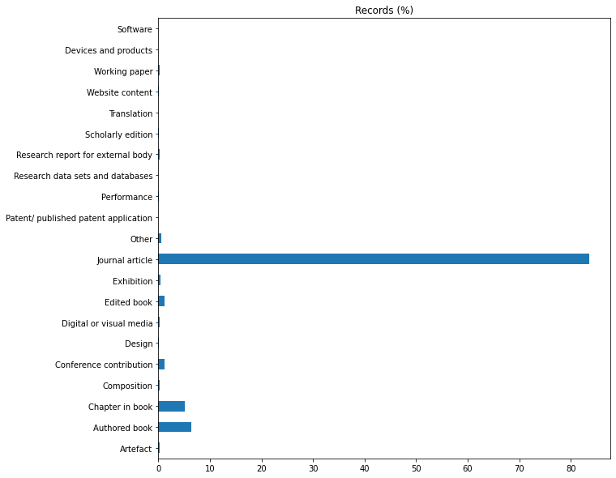
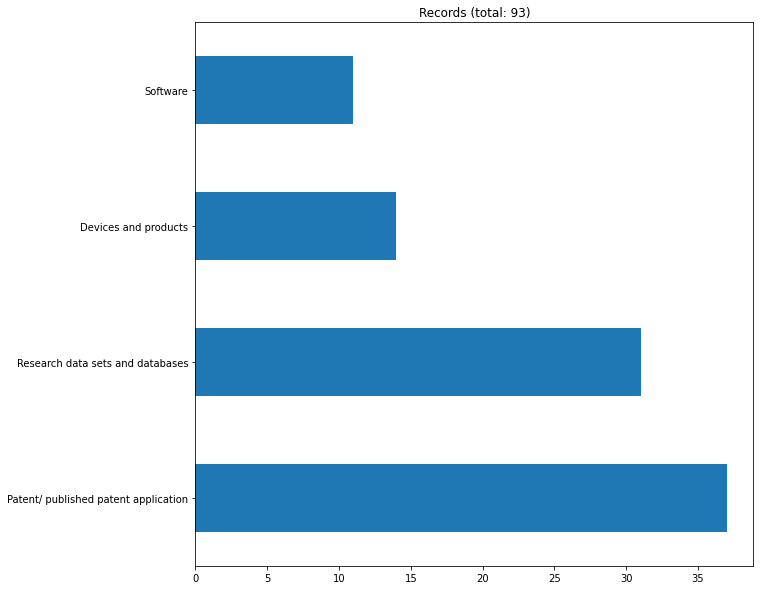

## Preliminary study of the REF 2021 submissions data

## Explore the `Outputs` table

#### Read and preprocess data

#### Simple counts

    
    All records
    -----------
    Output type name
                                          Records  Records (%)
    Output type name                                          
    Journal article                        154826    83.529894
    Authored book                           11801     6.366736
    Chapter in book                          9475     5.111840
    Conference contribution                  2272     1.225763
    Edited book                              2135     1.151850
    Other                                    1146     0.618276
    Exhibition                                751     0.405171
    Research report for external body         431     0.232528
    Composition                               430     0.231989
    Working paper                             390     0.210408
    Artefact                                  378     0.203934
    Digital or visual media                   360     0.194223
    Scholarly edition                         329     0.177498
    Performance                               312     0.168327
    Design                                    119     0.064201
    Website content                            67     0.036147
    Translation                                38     0.020501
    Patent/ published patent application       37     0.019962
    Research data sets and databases           31     0.016725
    Devices and products                       14     0.007553
    Software                                   11     0.005935

    

    

    
    Records in categories that should/could be directly linked to software
    -----------------------------------------------------------------------
    
    Records in categories
    ['Research data sets and databases', 'Devices and products', 'Patent/ published patent application', 'Software']
    
    Output type name
                                          Records  Records (%)
    Output type name                                          
    Patent/ published patent application       37    39.784946
    Research data sets and databases           31    33.333333
    Devices and products                       14    15.053763
    Software                                   11    11.827957

    

    

    
    Print out 'Software' outputs

<table id="T_2f992_">
  <thead>
    <tr>
      <th class="blank level0" >&nbsp;</th>
      <th class="col_heading level0 col0" >Institution name</th>
      <th class="col_heading level0 col1" >Title</th>
      <th class="col_heading level0 col2" >Main panel name</th>
      <th class="col_heading level0 col3" >Unit of assessment name</th>
    </tr>
  </thead>
  <tbody>
    <tr>
      <th id="T_2f992_level0_row0" class="row_heading level0 row0" >24667</th>
      <td id="T_2f992_row0_col0" class="data row0 col0" >University of Ulster</td>
      <td id="T_2f992_row0_col1" class="data row0 col1" >axial3d Insight</td>
      <td id="T_2f992_row0_col2" class="data row0 col2" >Arts and humanities</td>
      <td id="T_2f992_row0_col3" class="data row0 col3" >Art and Design: History, Practice and Theory</td>
    </tr>
    <tr>
      <th id="T_2f992_level0_row1" class="row_heading level0 row1" >29928</th>
      <td id="T_2f992_row1_col0" class="data row1 col0" >Leeds Beckett University</td>
      <td id="T_2f992_row1_col1" class="data row1 col1" >CAGD</td>
      <td id="T_2f992_row1_col2" class="data row1 col2" >Arts and humanities</td>
      <td id="T_2f992_row1_col3" class="data row1 col3" >Art and Design: History, Practice and Theory</td>
    </tr>
    <tr>
      <th id="T_2f992_level0_row2" class="row_heading level0 row2" >60339</th>
      <td id="T_2f992_row2_col0" class="data row2 col0" >University College London</td>
      <td id="T_2f992_row2_col1" class="data row2 col1" >EPPI-Reviewer: advanced software for systematic reviews, maps and evidence synthesis</td>
      <td id="T_2f992_row2_col2" class="data row2 col2" >Social sciences</td>
      <td id="T_2f992_row2_col3" class="data row2 col3" >Education</td>
    </tr>
    <tr>
      <th id="T_2f992_level0_row3" class="row_heading level0 row3" >77283</th>
      <td id="T_2f992_row3_col0" class="data row3 col0" >University of Exeter</td>
      <td id="T_2f992_row3_col1" class="data row3 col1" >Hidden Florence</td>
      <td id="T_2f992_row3_col2" class="data row3 col2" >Arts and humanities</td>
      <td id="T_2f992_row3_col3" class="data row3 col3" >Modern Languages and Linguistics</td>
    </tr>
    <tr>
      <th id="T_2f992_level0_row4" class="row_heading level0 row4" >90777</th>
      <td id="T_2f992_row4_col0" class="data row4 col0" >The University of Manchester</td>
      <td id="T_2f992_row4_col1" class="data row4 col1" >JBMC: A Bounded Model Checking Tool for Verifying Java Bytecode</td>
      <td id="T_2f992_row4_col2" class="data row4 col2" >Physical sciences, engineering and mathematics</td>
      <td id="T_2f992_row4_col3" class="data row4 col3" >Computer Science and Informatics</td>
    </tr>
    <tr>
      <th id="T_2f992_level0_row5" class="row_heading level0 row5" >101573</th>
      <td id="T_2f992_row5_col0" class="data row5 col0" >University of Edinburgh</td>
      <td id="T_2f992_row5_col1" class="data row5 col1" >Met Office NERC Cloud model (MONC)</td>
      <td id="T_2f992_row5_col2" class="data row5 col2" >Physical sciences, engineering and mathematics</td>
      <td id="T_2f992_row5_col3" class="data row5 col3" >Computer Science and Informatics</td>
    </tr>
    <tr>
      <th id="T_2f992_level0_row6" class="row_heading level0 row6" >117686</th>
      <td id="T_2f992_row6_col0" class="data row6 col0" >Heriot-Watt University</td>
      <td id="T_2f992_row6_col1" class="data row6 col1" >PDSLASSO & LASSOPACK : Stata module for post-selection and post-regularization OLS or IV estimation and inference</td>
      <td id="T_2f992_row6_col2" class="data row6 col2" >Social sciences</td>
      <td id="T_2f992_row6_col3" class="data row6 col3" >Business and Management Studies</td>
    </tr>
    <tr>
      <th id="T_2f992_level0_row7" class="row_heading level0 row7" >129009</th>
      <td id="T_2f992_row7_col0" class="data row7 col0" >University College London</td>
      <td id="T_2f992_row7_col1" class="data row7 col1" >RCarbon: Methods for calibrating and analysing radiocarbon dates</td>
      <td id="T_2f992_row7_col2" class="data row7 col2" >Social sciences</td>
      <td id="T_2f992_row7_col3" class="data row7 col3" >Archaeology</td>
    </tr>
    <tr>
      <th id="T_2f992_level0_row8" class="row_heading level0 row8" >129797</th>
      <td id="T_2f992_row8_col0" class="data row8 col0" >University of Exeter</td>
      <td id="T_2f992_row8_col1" class="data row8 col1" >Recogito Semantic Annotation platform</td>
      <td id="T_2f992_row8_col2" class="data row8 col2" >Arts and humanities</td>
      <td id="T_2f992_row8_col3" class="data row8 col3" >Classics</td>
    </tr>
    <tr>
      <th id="T_2f992_level0_row9" class="row_heading level0 row9" >164598</th>
      <td id="T_2f992_row9_col0" class="data row9 col0" >University of Cambridge</td>
      <td id="T_2f992_row9_col1" class="data row9 col1" >The Portable Antiquities Scheme's Database source code</td>
      <td id="T_2f992_row9_col2" class="data row9 col2" >Arts and humanities</td>
      <td id="T_2f992_row9_col3" class="data row9 col3" >Art and Design: History, Practice and Theory</td>
    </tr>
    <tr>
      <th id="T_2f992_level0_row10" class="row_heading level0 row10" >181273</th>
      <td id="T_2f992_row10_col0" class="data row10 col0" >University of the Arts, London</td>
      <td id="T_2f992_row10_col1" class="data row10 col1" >Wekinator 2.0</td>
      <td id="T_2f992_row10_col2" class="data row10 col2" >Arts and humanities</td>
      <td id="T_2f992_row10_col3" class="data row10 col3" >Art and Design: History, Practice and Theory</td>
    </tr>
  </tbody>
</table>

<table id="T_8a4be_">
  <thead>
    <tr>
      <th class="blank level0" >&nbsp;</th>
      <th class="col_heading level0 col0" >Title</th>
    </tr>
  </thead>
  <tbody>
    <tr>
      <th id="T_8a4be_level0_row0" class="row_heading level0 row0" >395</th>
      <td id="T_8a4be_row0_col0" class="data row0 col0" >"Dynamic rig for validation of control algorithms at high angles of attack"</td>
    </tr>
    <tr>
      <th id="T_8a4be_level0_row1" class="row_heading level0 row1" >1086</th>
      <td id="T_8a4be_row1_col0" class="data row1 col0" >"Solving multiobjective constrained trajectory optimization problem by an extended evolutionary algorithm"</td>
    </tr>
    <tr>
      <th id="T_8a4be_level0_row2" class="row_heading level0 row2" >1103</th>
      <td id="T_8a4be_row2_col0" class="data row2 col0" >"Stencil selection algorithms for WENO schemes on unstructured meshes"</td>
    </tr>
    <tr>
      <th id="T_8a4be_level0_row3" class="row_heading level0 row3" >4222</th>
      <td id="T_8a4be_row3_col0" class="data row3 col0" >3D buried utility location using a marching-cross-section algorithm for multi-sensor data fusion</td>
    </tr>
    <tr>
      <th id="T_8a4be_level0_row4" class="row_heading level0 row4" >4504</th>
      <td id="T_8a4be_row4_col0" class="data row4 col0" >A ‘Best-of-Breed’ approach for designing a fast algorithm for computing fixpoints of Galois
Connections</td>
    </tr>
    <tr>
      <th id="T_8a4be_level0_row5" class="row_heading level0 row5" >4817</th>
      <td id="T_8a4be_row5_col0" class="data row5 col0" >A branch and price algorithm to solve the quickest multicommodity k-splittable flow problem</td>
    </tr>
    <tr>
      <th id="T_8a4be_level0_row6" class="row_heading level0 row6" >4917</th>
      <td id="T_8a4be_row6_col0" class="data row6 col0" >A Cartesian cut cell based two-way strong fluid-solid coupling algorithm for 2D floating bodies</td>
    </tr>
    <tr>
      <th id="T_8a4be_level0_row7" class="row_heading level0 row7" >5133</th>
      <td id="T_8a4be_row7_col0" class="data row7 col0" >A clipped-optimal control algorithm for semi-active vehicle suspensions: Theory and experimental evaluation</td>
    </tr>
    <tr>
      <th id="T_8a4be_level0_row8" class="row_heading level0 row8" >5232</th>
      <td id="T_8a4be_row8_col0" class="data row8 col0" >A combination selection algorithm on forecasting</td>
    </tr>
    <tr>
      <th id="T_8a4be_level0_row9" class="row_heading level0 row9" >5285</th>
      <td id="T_8a4be_row9_col0" class="data row9 col0" >A community effort to assess and improve drug sensitivity prediction algorithms</td>
    </tr>
    <tr>
      <th id="T_8a4be_level0_row10" class="row_heading level0 row10" >5476</th>
      <td id="T_8a4be_row10_col0" class="data row10 col0" >A competitive divide-and-conquer algorithm for unconstrained large-scale black-box optimization</td>
    </tr>
    <tr>
      <th id="T_8a4be_level0_row11" class="row_heading level0 row11" >5560</th>
      <td id="T_8a4be_row11_col0" class="data row11 col0" >A computational algorithm to predict shRNA potency.</td>
    </tr>
    <tr>
      <th id="T_8a4be_level0_row12" class="row_heading level0 row12" >5662</th>
      <td id="T_8a4be_row12_col0" class="data row12 col0" >A constant-factor approximation algorithm for the asymmetric traveling salesman problem</td>
    </tr>
    <tr>
      <th id="T_8a4be_level0_row13" class="row_heading level0 row13" >5663</th>
      <td id="T_8a4be_row13_col0" class="data row13 col0" >A constant-time algorithm for middle levels Gray codes</td>
    </tr>
    <tr>
      <th id="T_8a4be_level0_row14" class="row_heading level0 row14" >5670</th>
      <td id="T_8a4be_row14_col0" class="data row14 col0" >A constraint-based genetic algorithm for optimizing neural network architectures for detection of loss of coolant accidents of nuclear power plants</td>
    </tr>
    <tr>
      <th id="T_8a4be_level0_row15" class="row_heading level0 row15" >5731</th>
      <td id="T_8a4be_row15_col0" class="data row15 col0" >A convolutional neural network based Chinese text detection algorithm via text structure modeling</td>
    </tr>
    <tr>
      <th id="T_8a4be_level0_row16" class="row_heading level0 row16" >5930</th>
      <td id="T_8a4be_row16_col0" class="data row16 col0" >A cubature based algorithm to solve decoupled McKean-Vlasov forward-backward stochastic differential equations</td>
    </tr>
    <tr>
      <th id="T_8a4be_level0_row17" class="row_heading level0 row17" >5958</th>
      <td id="T_8a4be_row17_col0" class="data row17 col0" >A cycle-based evolutionary algorithm for the fixed-charge capacitated multi-commodity network design problem</td>
    </tr>
    <tr>
      <th id="T_8a4be_level0_row18" class="row_heading level0 row18" >5959</th>
      <td id="T_8a4be_row18_col0" class="data row18 col0" >A cycle-based evolutionary algorithm for the fixed-charge capacitated multi-commodity network design problem</td>
    </tr>
    <tr>
      <th id="T_8a4be_level0_row19" class="row_heading level0 row19" >5960</th>
      <td id="T_8a4be_row19_col0" class="data row19 col0" >A cycle-based evolutionary algorithm for the fixed-charge capacitated multi-commodity network design problem</td>
    </tr>
    <tr>
      <th id="T_8a4be_level0_row20" class="row_heading level0 row20" >5961</th>
      <td id="T_8a4be_row20_col0" class="data row20 col0" >A cycle-based evolutionary algorithm for the fixed-charge capacitated multi-commodity network design problem</td>
    </tr>
    <tr>
      <th id="T_8a4be_level0_row21" class="row_heading level0 row21" >5962</th>
      <td id="T_8a4be_row21_col0" class="data row21 col0" >A cycling chaos-based cryptic-free algorithm for image steganography</td>
    </tr>
    <tr>
      <th id="T_8a4be_level0_row22" class="row_heading level0 row22" >6231</th>
      <td id="T_8a4be_row22_col0" class="data row22 col0" >A discrete firefly algorithm to solve a rich vehicle routing problem modelling a newspaper distribution system with recycling policy</td>
    </tr>
    <tr>
      <th id="T_8a4be_level0_row23" class="row_heading level0 row23" >6261</th>
      <td id="T_8a4be_row23_col0" class="data row23 col0" >A distributed consensus algorithm for decision making in service-oriented internet of things</td>
    </tr>
    <tr>
      <th id="T_8a4be_level0_row24" class="row_heading level0 row24" >6262</th>
      <td id="T_8a4be_row24_col0" class="data row24 col0" >A distributed consensus algorithm for decision making in service-oriented internet of things</td>
    </tr>
    <tr>
      <th id="T_8a4be_level0_row25" class="row_heading level0 row25" >6366</th>
      <td id="T_8a4be_row25_col0" class="data row25 col0" >A dynamic ensemble learning algorithm for neural networks</td>
    </tr>
    <tr>
      <th id="T_8a4be_level0_row26" class="row_heading level0 row26" >6403</th>
      <td id="T_8a4be_row26_col0" class="data row26 col0" >A dynamic two-dimensional (D2D) weight-based map-matching algorithm</td>
    </tr>
    <tr>
      <th id="T_8a4be_level0_row27" class="row_heading level0 row27" >6451</th>
      <td id="T_8a4be_row27_col0" class="data row27 col0" >A family of globally optimal branch-and-bound algorithms for 2D–3D correspondence-free registration</td>
    </tr>
    <tr>
      <th id="T_8a4be_level0_row28" class="row_heading level0 row28" >6452</th>
      <td id="T_8a4be_row28_col0" class="data row28 col0" >A family of globally optimal branch-and-bound algorithms for 2D–3D correspondence-free registration</td>
    </tr>
    <tr>
      <th id="T_8a4be_level0_row29" class="row_heading level0 row29" >6475</th>
      <td id="T_8a4be_row29_col0" class="data row29 col0" >A fast approximation algorithm for solving the complete set packing problem</td>
    </tr>
    <tr>
      <th id="T_8a4be_level0_row30" class="row_heading level0 row30" >6485</th>
      <td id="T_8a4be_row30_col0" class="data row30 col0" >A fast mode superposition algorithm and its application to the analysis of bridges under moving loads</td>
    </tr>
    <tr>
      <th id="T_8a4be_level0_row31" class="row_heading level0 row31" >6491</th>
      <td id="T_8a4be_row31_col0" class="data row31 col0" >A faster polynomial-space algorithm for Max 2-CSP</td>
    </tr>
    <tr>
      <th id="T_8a4be_level0_row32" class="row_heading level0 row32" >6777</th>
      <td id="T_8a4be_row32_col0" class="data row32 col0" >A fully-parallel turbo decoding algorithm</td>
    </tr>
    <tr>
      <th id="T_8a4be_level0_row33" class="row_heading level0 row33" >6805</th>
      <td id="T_8a4be_row33_col0" class="data row33 col0" >A fuzzy genetic programming-based algorithm for subgroup discovery and the application to one problem of pathogenesis of acute sore throat conditions in humans</td>
    </tr>
    <tr>
      <th id="T_8a4be_level0_row34" class="row_heading level0 row34" >6806</th>
      <td id="T_8a4be_row34_col0" class="data row34 col0" >A fuzzy genetic programming-based algorithm for subgroup discovery and the application to one problem of pathogenesis of acute sore throat conditions in humans</td>
    </tr>
    <tr>
      <th id="T_8a4be_level0_row35" class="row_heading level0 row35" >6823</th>
      <td id="T_8a4be_row35_col0" class="data row35 col0" >A game theoretic distributed algorithm for FeICIC optimization in LTE-A HetNets</td>
    </tr>
    <tr>
      <th id="T_8a4be_level0_row36" class="row_heading level0 row36" >6869</th>
      <td id="T_8a4be_row36_col0" class="data row36 col0" >A general construction for parallelizing Metropolis-Hastings algorithms</td>
    </tr>
    <tr>
      <th id="T_8a4be_level0_row37" class="row_heading level0 row37" >6905</th>
      <td id="T_8a4be_row37_col0" class="data row37 col0" >A general reinforcement learning algorithm that masters chess, shogi, and Go through self-play</td>
    </tr>
    <tr>
      <th id="T_8a4be_level0_row38" class="row_heading level0 row38" >6957</th>
      <td id="T_8a4be_row38_col0" class="data row38 col0" >A genetic algorithm approach to optimising random forests applied to class engineered data</td>
    </tr>
    <tr>
      <th id="T_8a4be_level0_row39" class="row_heading level0 row39" >6958</th>
      <td id="T_8a4be_row39_col0" class="data row39 col0" >A genetic algorithm to find optimal reading test word subsets for estimating full-scale IQ</td>
    </tr>
    <tr>
      <th id="T_8a4be_level0_row40" class="row_heading level0 row40" >7153</th>
      <td id="T_8a4be_row40_col0" class="data row40 col0" >A graph theory based energy routing algorithm in Energy Local Area Network (e-LAN)</td>
    </tr>
    <tr>
      <th id="T_8a4be_level0_row41" class="row_heading level0 row41" >7267</th>
      <td id="T_8a4be_row41_col0" class="data row41 col0" >A heuristics based global navigation satellite system data reduction algorithm integrated with map-matching</td>
    </tr>
    <tr>
      <th id="T_8a4be_level0_row42" class="row_heading level0 row42" >7285</th>
      <td id="T_8a4be_row42_col0" class="data row42 col0" >A hierarchical multilevel markov chain monte carlo algorithm with applications to uncertainty quantification in subsurface flow</td>
    </tr>
    <tr>
      <th id="T_8a4be_level0_row43" class="row_heading level0 row43" >7286</th>
      <td id="T_8a4be_row43_col0" class="data row43 col0" >A hierarchical multilevel Markov chain Monte Carlo algorithm with applications to uncertainty quantification in subsurface flow</td>
    </tr>
    <tr>
      <th id="T_8a4be_level0_row44" class="row_heading level0 row44" >7495</th>
      <td id="T_8a4be_row44_col0" class="data row44 col0" >A hybrid algorithm for a vehicle routing problem with realistic constraints</td>
    </tr>
    <tr>
      <th id="T_8a4be_level0_row45" class="row_heading level0 row45" >7496</th>
      <td id="T_8a4be_row45_col0" class="data row45 col0" >A hybrid approach for character modeling using geometric primitives and shape-from-shading algorithm</td>
    </tr>
    <tr>
      <th id="T_8a4be_level0_row46" class="row_heading level0 row46" >7514</th>
      <td id="T_8a4be_row46_col0" class="data row46 col0" >A hybrid exact algorithm for complete set partitioning</td>
    </tr>
    <tr>
      <th id="T_8a4be_level0_row47" class="row_heading level0 row47" >7517</th>
      <td id="T_8a4be_row47_col0" class="data row47 col0" >A hybrid integer programming and variable neighborhood search algorithm to solve Nurse Rostering Problems</td>
    </tr>
    <tr>
      <th id="T_8a4be_level0_row48" class="row_heading level0 row48" >7653</th>
      <td id="T_8a4be_row48_col0" class="data row48 col0" >A large margin algorithm for automated segmentation of white matter hyperintensity</td>
    </tr>
    <tr>
      <th id="T_8a4be_level0_row49" class="row_heading level0 row49" >7755</th>
      <td id="T_8a4be_row49_col0" class="data row49 col0" >A lightweight QRS detector for single lead ECG signals using a max-min difference algorithm</td>
    </tr>
    <tr>
      <th id="T_8a4be_level0_row50" class="row_heading level0 row50" >7808</th>
      <td id="T_8a4be_row50_col0" class="data row50 col0" >A location aided controlled spraying routing algorithm for Delay Tolerant Networks</td>
    </tr>
    <tr>
      <th id="T_8a4be_level0_row51" class="row_heading level0 row51" >7818</th>
      <td id="T_8a4be_row51_col0" class="data row51 col0" >A LogitBoost-based algorithm for detecting known and unknown web attacks</td>
    </tr>
    <tr>
      <th id="T_8a4be_level0_row52" class="row_heading level0 row52" >8103</th>
      <td id="T_8a4be_row52_col0" class="data row52 col0" >A memetic algorithm for a multi-objective obnoxious waste location-routing problem: a case study</td>
    </tr>
    <tr>
      <th id="T_8a4be_level0_row53" class="row_heading level0 row53" >8581</th>
      <td id="T_8a4be_row53_col0" class="data row53 col0" >A multi-component two-phase flow algorithm for use in landfill processes modelling</td>
    </tr>
    <tr>
      <th id="T_8a4be_level0_row54" class="row_heading level0 row54" >8670</th>
      <td id="T_8a4be_row54_col0" class="data row54 col0" >A multi-objective genetic algorithm for optimisation of energy consumption and shop floor production performance</td>
    </tr>
    <tr>
      <th id="T_8a4be_level0_row55" class="row_heading level0 row55" >8671</th>
      <td id="T_8a4be_row55_col0" class="data row55 col0" >A multi-objective genetic algorithm for optimisation of energy consumption and shop floor production performance</td>
    </tr>
    <tr>
      <th id="T_8a4be_level0_row56" class="row_heading level0 row56" >8672</th>
      <td id="T_8a4be_row56_col0" class="data row56 col0" >A multi-objective genetic algorithm for optimisation of energy consumption and shop floor production performance</td>
    </tr>
    <tr>
      <th id="T_8a4be_level0_row57" class="row_heading level0 row57" >8690</th>
      <td id="T_8a4be_row57_col0" class="data row57 col0" >A multi-phase particle shifting algorithm for SPH simulations of violent hydrodynamics with a large number of particles</td>
    </tr>
    <tr>
      <th id="T_8a4be_level0_row58" class="row_heading level0 row58" >8738</th>
      <td id="T_8a4be_row58_col0" class="data row58 col0" >A multi-tier adaptive grid algorithm for the evolutionary multi-objective optimisation of complex problems</td>
    </tr>
    <tr>
      <th id="T_8a4be_level0_row59" class="row_heading level0 row59" >8855</th>
      <td id="T_8a4be_row59_col0" class="data row59 col0" >A neural network based policy iteration algorithm with global H2-superlinear convergence for stochastic games on domains</td>
    </tr>
    <tr>
      <th id="T_8a4be_level0_row60" class="row_heading level0 row60" >8887</th>
      <td id="T_8a4be_row60_col0" class="data row60 col0" >A new algorithm to diagnose atrial ectopic origin from multi lead ECG systems - insights from 3D virtual human atria and torso</td>
    </tr>
    <tr>
      <th id="T_8a4be_level0_row61" class="row_heading level0 row61" >8932</th>
      <td id="T_8a4be_row61_col0" class="data row61 col0" >A new branch-and-bound algorithm for the maximum edge-weighted clique problem</td>
    </tr>
    <tr>
      <th id="T_8a4be_level0_row62" class="row_heading level0 row62" >8968</th>
      <td id="T_8a4be_row62_col0" class="data row62 col0" >A new dominance relation-based evolutionary algorithm for many-objective optimization</td>
    </tr>
    <tr>
      <th id="T_8a4be_level0_row63" class="row_heading level0 row63" >9029</th>
      <td id="T_8a4be_row63_col0" class="data row63 col0" >A new image encryption algorithm based on heterogeneous chaotic neural network generator and dna encoding</td>
    </tr>
    <tr>
      <th id="T_8a4be_level0_row64" class="row_heading level0 row64" >9177</th>
      <td id="T_8a4be_row64_col0" class="data row64 col0" >A new rock slicing algorithm based on linear programming</td>
    </tr>
    <tr>
      <th id="T_8a4be_level0_row65" class="row_heading level0 row65" >9338</th>
      <td id="T_8a4be_row65_col0" class="data row65 col0" >A novel 2D image compression algorithm based on two levels DWT and DCT transforms with enhanced minimize-matrix-size algorithm for high resolution structured light 3D surface reconstruction</td>
    </tr>
    <tr>
      <th id="T_8a4be_level0_row66" class="row_heading level0 row66" >9354</th>
      <td id="T_8a4be_row66_col0" class="data row66 col0" >A novel aggregation-based dominance for Pareto-based evolutionary algorithms to configure software product lines</td>
    </tr>
    <tr>
      <th id="T_8a4be_level0_row67" class="row_heading level0 row67" >9355</th>
      <td id="T_8a4be_row67_col0" class="data row67 col0" >A novel algorithm for radar classification based on Doppler characteristics exploiting orthogonal pseudo-Zernike polynomials</td>
    </tr>
    <tr>
      <th id="T_8a4be_level0_row68" class="row_heading level0 row68" >9384</th>
      <td id="T_8a4be_row68_col0" class="data row68 col0" >A novel artificial bee colony based clustering algorithm for categorical data</td>
    </tr>
    <tr>
      <th id="T_8a4be_level0_row69" class="row_heading level0 row69" >9485</th>
      <td id="T_8a4be_row69_col0" class="data row69 col0" >A novel hybrid firefly algorithm for global optimization</td>
    </tr>
    <tr>
      <th id="T_8a4be_level0_row70" class="row_heading level0 row70" >9569</th>
      <td id="T_8a4be_row70_col0" class="data row70 col0" >A novel MPPT algorithm based on particle swarm optimization for photovoltaic systems</td>
    </tr>
    <tr>
      <th id="T_8a4be_level0_row71" class="row_heading level0 row71" >9695</th>
      <td id="T_8a4be_row71_col0" class="data row71 col0" >A novel two-archive strategy for evolutionary many-objective optimization algorithm based on reference points</td>
    </tr>
    <tr>
      <th id="T_8a4be_level0_row72" class="row_heading level0 row72" >9735</th>
      <td id="T_8a4be_row72_col0" class="data row72 col0" >A numerical measure of the instability of Mapper-type algorithms</td>
    </tr>
    <tr>
      <th id="T_8a4be_level0_row73" class="row_heading level0 row73" >9790</th>
      <td id="T_8a4be_row73_col0" class="data row73 col0" >A parallel self-organizing overlapping community detection algorithm based on swarm intelligence for large scale complex networks</td>
    </tr>
    <tr>
      <th id="T_8a4be_level0_row74" class="row_heading level0 row74" >9792</th>
      <td id="T_8a4be_row74_col0" class="data row74 col0" >A parallel surrogate model assisted evolutionary algorithm for electromagnetic design optimization</td>
    </tr>
    <tr>
      <th id="T_8a4be_level0_row75" class="row_heading level0 row75" >9794</th>
      <td id="T_8a4be_row75_col0" class="data row75 col0" >A parameter-free discrete particle swarm algorithm and its application to multi-objective pavement maintenance schemes</td>
    </tr>
    <tr>
      <th id="T_8a4be_level0_row76" class="row_heading level0 row76" >9875</th>
      <td id="T_8a4be_row76_col0" class="data row76 col0" >A periodontal ligament driven remodeling algorithm for orthodontic tooth movement</td>
    </tr>
    <tr>
      <th id="T_8a4be_level0_row77" class="row_heading level0 row77" >10206</th>
      <td id="T_8a4be_row77_col0" class="data row77 col0" >A preconditioned Multiple Shooting Shadowing algorithm for the sensitivity analysis of chaotic systems</td>
    </tr>
    <tr>
      <th id="T_8a4be_level0_row78" class="row_heading level0 row78" >10235</th>
      <td id="T_8a4be_row78_col0" class="data row78 col0" >A preventive model for muscle injuries: a novel approach based on learning algorithms</td>
    </tr>
    <tr>
      <th id="T_8a4be_level0_row79" class="row_heading level0 row79" >10472</th>
      <td id="T_8a4be_row79_col0" class="data row79 col0" >A quality correlation algorithm for tolerance synthesis in manufacturing operations</td>
    </tr>
    <tr>
      <th id="T_8a4be_level0_row80" class="row_heading level0 row80" >11064</th>
      <td id="T_8a4be_row80_col0" class="data row80 col0" >A rigorous version of R.P. Brent's model for the binary Euclidean algorithm</td>
    </tr>
    <tr>
      <th id="T_8a4be_level0_row81" class="row_heading level0 row81" >11088</th>
      <td id="T_8a4be_row81_col0" class="data row81 col0" >A robust and artifact resistant algorithm of ultrawideband imaging system for breast cancer detection</td>
    </tr>
    <tr>
      <th id="T_8a4be_level0_row82" class="row_heading level0 row82" >11103</th>
      <td id="T_8a4be_row82_col0" class="data row82 col0" >A robust fuzzy mathematical programming model for the closed-loop supply chain network design and a whale optimization solution algorithm</td>
    </tr>
    <tr>
      <th id="T_8a4be_level0_row83" class="row_heading level0 row83" >11164</th>
      <td id="T_8a4be_row83_col0" class="data row83 col0" >A rough-cut approach for evaluating location-routing decisions via approximation algorithms</td>
    </tr>
    <tr>
      <th id="T_8a4be_level0_row84" class="row_heading level0 row84" >11206</th>
      <td id="T_8a4be_row84_col0" class="data row84 col0" >A scalar projection and angle based evolutionary algorithm for many-objective optimization problems</td>
    </tr>
    <tr>
      <th id="T_8a4be_level0_row85" class="row_heading level0 row85" >11212</th>
      <td id="T_8a4be_row85_col0" class="data row85 col0" >A scattering and repulsive swarm intelligence algorithm for solving global optimization problems</td>
    </tr>
    <tr>
      <th id="T_8a4be_level0_row86" class="row_heading level0 row86" >11310</th>
      <td id="T_8a4be_row86_col0" class="data row86 col0" >A self-sensing and self-actuating active rotor with an algorithmic direct search controller</td>
    </tr>
    <tr>
      <th id="T_8a4be_level0_row87" class="row_heading level0 row87" >11357</th>
      <td id="T_8a4be_row87_col0" class="data row87 col0" >A sequential learning algorithm for a spiking neural classifier</td>
    </tr>
    <tr>
      <th id="T_8a4be_level0_row88" class="row_heading level0 row88" >11418</th>
      <td id="T_8a4be_row88_col0" class="data row88 col0" >A simple algorithm for the offline recalibration of eye-tracking data through best-fitting linear transformation</td>
    </tr>
    <tr>
      <th id="T_8a4be_level0_row89" class="row_heading level0 row89" >11462</th>
      <td id="T_8a4be_row89_col0" class="data row89 col0" >A simpler and faster strongly polynomial algorithm for generalized flow maximization</td>
    </tr>
    <tr>
      <th id="T_8a4be_level0_row90" class="row_heading level0 row90" >11715</th>
      <td id="T_8a4be_row90_col0" class="data row90 col0" >A spectral clustering search algorithm for predicting shallow landslide size and location</td>
    </tr>
    <tr>
      <th id="T_8a4be_level0_row91" class="row_heading level0 row91" >11739</th>
      <td id="T_8a4be_row91_col0" class="data row91 col0" >A stabilised scenario decomposition algorithm applied to stochastic unit commitment problems</td>
    </tr>
    <tr>
      <th id="T_8a4be_level0_row92" class="row_heading level0 row92" >11742</th>
      <td id="T_8a4be_row92_col0" class="data row92 col0" >A stable and optimally convergent LaTIn-CutFEM algorithm for multiple unilateral contact problems</td>
    </tr>
    <tr>
      <th id="T_8a4be_level0_row93" class="row_heading level0 row93" >11792</th>
      <td id="T_8a4be_row93_col0" class="data row93 col0" >A step counting hill climbing algorithm</td>
    </tr>
    <tr>
      <th id="T_8a4be_level0_row94" class="row_heading level0 row94" >11817</th>
      <td id="T_8a4be_row94_col0" class="data row94 col0" >A stochastic multi-criteria divisive hierarchical clustering algorithm</td>
    </tr>
    <tr>
      <th id="T_8a4be_level0_row95" class="row_heading level0 row95" >11849</th>
      <td id="T_8a4be_row95_col0" class="data row95 col0" >A strongly polynomial algorithm for generalized flow maximization</td>
    </tr>
    <tr>
      <th id="T_8a4be_level0_row96" class="row_heading level0 row96" >11996</th>
      <td id="T_8a4be_row96_col0" class="data row96 col0" >A supervised learning algorithm for learning precise timing of multiple spikes in multilayer spiking neural networks</td>
    </tr>
    <tr>
      <th id="T_8a4be_level0_row97" class="row_heading level0 row97" >12041</th>
      <td id="T_8a4be_row97_col0" class="data row97 col0" >A symmetry preserving algorithm for matrix scaling</td>
    </tr>
    <tr>
      <th id="T_8a4be_level0_row98" class="row_heading level0 row98" >12814</th>
      <td id="T_8a4be_row98_col0" class="data row98 col0" >A variationally consistent streamline upwind Petrov-Galerkin smooth particle hydrodynamics algorithm for large strain solid dynamic</td>
    </tr>
    <tr>
      <th id="T_8a4be_level0_row99" class="row_heading level0 row99" >12815</th>
      <td id="T_8a4be_row99_col0" class="data row99 col0" >A variationally consistent Streamline Upwind Petrov–Galerkin Smooth Particle Hydrodynamics algorithm for large strain solid dynamics</td>
    </tr>
    <tr>
      <th id="T_8a4be_level0_row100" class="row_heading level0 row100" >12834</th>
      <td id="T_8a4be_row100_col0" class="data row100 col0" >A vertex centred Finite Volume Jameson-Schmidt-Turkel (JST) algorithm for a mixed conservation formulation in solid dynamics</td>
    </tr>
    <tr>
      <th id="T_8a4be_level0_row101" class="row_heading level0 row101" >13045</th>
      <td id="T_8a4be_row101_col0" class="data row101 col0" >Ab initio multiple cloning algorithm for quantum nonadiabatic molecular dynamics</td>
    </tr>
    <tr>
      <th id="T_8a4be_level0_row102" class="row_heading level0 row102" >13146</th>
      <td id="T_8a4be_row102_col0" class="data row102 col0" >ABLE: an activity-based level set segmentation algorithm for two-photon calcium imaging data</td>
    </tr>
    <tr>
      <th id="T_8a4be_level0_row103" class="row_heading level0 row103" >13440</th>
      <td id="T_8a4be_row103_col0" class="data row103 col0" >Accelerating the DC algorithm for smooth functions</td>
    </tr>
    <tr>
      <th id="T_8a4be_level0_row104" class="row_heading level0 row104" >13954</th>
      <td id="T_8a4be_row104_col0" class="data row104 col0" >Acoustic signal processing with robust machine learning algorithm for improved monitoring of particulate solid materials in a gas flowline</td>
    </tr>
    <tr>
      <th id="T_8a4be_level0_row105" class="row_heading level0 row105" >14450</th>
      <td id="T_8a4be_row105_col0" class="data row105 col0" >AdaBoost-CNN: an adaptive boosting algorithm for convolutional neural networks to classify multi-class imbalanced datasets using transfer learning</td>
    </tr>
    <tr>
      <th id="T_8a4be_level0_row106" class="row_heading level0 row106" >14451</th>
      <td id="T_8a4be_row106_col0" class="data row106 col0" >AdaBoost-CNN: An adaptive boosting algorithm for convolutional neural networks to classify multi-class imbalanced datasets using transfer learning</td>
    </tr>
    <tr>
      <th id="T_8a4be_level0_row107" class="row_heading level0 row107" >14480</th>
      <td id="T_8a4be_row107_col0" class="data row107 col0" >ADAPT: an algorithm incorporating PRO-C3 accurately identifies patients with NAFLD and advanced fibrosis</td>
    </tr>
    <tr>
      <th id="T_8a4be_level0_row108" class="row_heading level0 row108" >17200</th>
      <td id="T_8a4be_row108_col0" class="data row108 col0" >An accurate method for the PV model identification based on a genetic algorithm and the interior-point method</td>
    </tr>
    <tr>
      <th id="T_8a4be_level0_row109" class="row_heading level0 row109" >17286</th>
      <td id="T_8a4be_row109_col0" class="data row109 col0" >An algorithm for dynamic order-picking in warehouse operations</td>
    </tr>
    <tr>
      <th id="T_8a4be_level0_row110" class="row_heading level0 row110" >17287</th>
      <td id="T_8a4be_row110_col0" class="data row110 col0" >An algorithm for learning shape and appearance models without annotations.</td>
    </tr>
    <tr>
      <th id="T_8a4be_level0_row111" class="row_heading level0 row111" >17288</th>
      <td id="T_8a4be_row111_col0" class="data row111 col0" >An algorithm for moment-matching scenario generation with application to financial portfolio optimization</td>
    </tr>
    <tr>
      <th id="T_8a4be_level0_row112" class="row_heading level0 row112" >17289</th>
      <td id="T_8a4be_row112_col0" class="data row112 col0" >An algorithm for real and complex rational minimax approximation</td>
    </tr>
    <tr>
      <th id="T_8a4be_level0_row113" class="row_heading level0 row113" >17559</th>
      <td id="T_8a4be_row113_col0" class="data row113 col0" >An assessment of algorithms to estimate respiratory rate from the electrocardiogram and photoplethysmogram</td>
    </tr>
    <tr>
      <th id="T_8a4be_level0_row114" class="row_heading level0 row114" >17560</th>
      <td id="T_8a4be_row114_col0" class="data row114 col0" >An assessment of algorithms to estimate respiratory rate from the electrocardiogram and photoplethysmogram</td>
    </tr>
    <tr>
      <th id="T_8a4be_level0_row115" class="row_heading level0 row115" >17677</th>
      <td id="T_8a4be_row115_col0" class="data row115 col0" >An auxiliary particle filtering algorithm with inequality constraints</td>
    </tr>
    <tr>
      <th id="T_8a4be_level0_row116" class="row_heading level0 row116" >17755</th>
      <td id="T_8a4be_row116_col0" class="data row116 col0" >An efficient Adaptive Mesh Refinement (AMR) algorithm for the Discontinuous Galerkin method : applications for the computation of compressible two-phase flows</td>
    </tr>
    <tr>
      <th id="T_8a4be_level0_row117" class="row_heading level0 row117" >17756</th>
      <td id="T_8a4be_row117_col0" class="data row117 col0" >An efficient algorithm for numerical computations of continuous densities of states</td>
    </tr>
    <tr>
      <th id="T_8a4be_level0_row118" class="row_heading level0 row118" >17757</th>
      <td id="T_8a4be_row118_col0" class="data row118 col0" >An efficient algorithm for numerical computations of continuous densities of states</td>
    </tr>
    <tr>
      <th id="T_8a4be_level0_row119" class="row_heading level0 row119" >17759</th>
      <td id="T_8a4be_row119_col0" class="data row119 col0" >An efficient algorithm for partially matched services in internet of services</td>
    </tr>
    <tr>
      <th id="T_8a4be_level0_row120" class="row_heading level0 row120" >17779</th>
      <td id="T_8a4be_row120_col0" class="data row120 col0" >An efficient heuristic algorithm for the alternative-fuel station location problem</td>
    </tr>
    <tr>
      <th id="T_8a4be_level0_row121" class="row_heading level0 row121" >17851</th>
      <td id="T_8a4be_row121_col0" class="data row121 col0" >An empirical comparison of classification algorithms for mortgage default prediction: evidence from a distressed mortgage market</td>
    </tr>
    <tr>
      <th id="T_8a4be_level0_row122" class="row_heading level0 row122" >17922</th>
      <td id="T_8a4be_row122_col0" class="data row122 col0" >An energy-aware service composition algorithm for multiple cloud-based IoT applications</td>
    </tr>
    <tr>
      <th id="T_8a4be_level0_row123" class="row_heading level0 row123" >17926</th>
      <td id="T_8a4be_row123_col0" class="data row123 col0" >An energy-efficient torque-vectoring algorithm for electric vehicles with multiple motors</td>
    </tr>
    <tr>
      <th id="T_8a4be_level0_row124" class="row_heading level0 row124" >18013</th>
      <td id="T_8a4be_row124_col0" class="data row124 col0" >An estimation of distribution algorithm for public transport driver scheduling</td>
    </tr>
    <tr>
      <th id="T_8a4be_level0_row125" class="row_heading level0 row125" >18043</th>
      <td id="T_8a4be_row125_col0" class="data row125 col0" >An evaluation of noise reduction algorithms for particle-based fluid simulations in multi-scale applications</td>
    </tr>
    <tr>
      <th id="T_8a4be_level0_row126" class="row_heading level0 row126" >18090</th>
      <td id="T_8a4be_row126_col0" class="data row126 col0" >An evidence-based treatment algorithm for colorectal polyp cancers : results from the Scottish Screen-detected Polyp Cancer Study (SSPoCS)</td>
    </tr>
    <tr>
      <th id="T_8a4be_level0_row127" class="row_heading level0 row127" >18118</th>
      <td id="T_8a4be_row127_col0" class="data row127 col0" >An exact algorithm for the static rebalancing problem arising in bicycle sharing systems</td>
    </tr>
    <tr>
      <th id="T_8a4be_level0_row128" class="row_heading level0 row128" >18383</th>
      <td id="T_8a4be_row128_col0" class="data row128 col0" >An image recapture detection algorithm based on learning dictionaries of edge profiles</td>
    </tr>
    <tr>
      <th id="T_8a4be_level0_row129" class="row_heading level0 row129" >18384</th>
      <td id="T_8a4be_row129_col0" class="data row129 col0" >An image reconstruction algorithm for 3D electrical impedance mammography</td>
    </tr>
    <tr>
      <th id="T_8a4be_level0_row130" class="row_heading level0 row130" >18406</th>
      <td id="T_8a4be_row130_col0" class="data row130 col0" >An implicit algorithm of solving Navier–Stokes equations to simulate flows in anisotropic porous media</td>
    </tr>
    <tr>
      <th id="T_8a4be_level0_row131" class="row_heading level0 row131" >18416</th>
      <td id="T_8a4be_row131_col0" class="data row131 col0" >An improved discrete bat algorithm for symmetric and asymmetric traveling salesman problems</td>
    </tr>
    <tr>
      <th id="T_8a4be_level0_row132" class="row_heading level0 row132" >18427</th>
      <td id="T_8a4be_row132_col0" class="data row132 col0" >An improved model of charge transfer inefficiency and correction algorithm for the Hubble Space Telescope</td>
    </tr>
    <tr>
      <th id="T_8a4be_level0_row133" class="row_heading level0 row133" >18537</th>
      <td id="T_8a4be_row133_col0" class="data row133 col0" >An innovative multi-sensor fusion algorithm to enhance positioning accuracy of an instrumented bicycle</td>
    </tr>
    <tr>
      <th id="T_8a4be_level0_row134" class="row_heading level0 row134" >18558</th>
      <td id="T_8a4be_row134_col0" class="data row134 col0" >An instructive algorithm for aircraft elevator sizing to be used in preliminary aircraft design software</td>
    </tr>
    <tr>
      <th id="T_8a4be_level0_row135" class="row_heading level0 row135" >18915</th>
      <td id="T_8a4be_row135_col0" class="data row135 col0" >An objective comparison of cell-tracking algorithms</td>
    </tr>
    <tr>
      <th id="T_8a4be_level0_row136" class="row_heading level0 row136" >18916</th>
      <td id="T_8a4be_row136_col0" class="data row136 col0" >An objective comparison of detection and segmentation algorithms for artefacts in clinical endoscopy</td>
    </tr>
    <tr>
      <th id="T_8a4be_level0_row137" class="row_heading level0 row137" >18917</th>
      <td id="T_8a4be_row137_col0" class="data row137 col0" >An objective comparison of detection and segmentation algorithms for artefacts in clinical endoscopy</td>
    </tr>
    <tr>
      <th id="T_8a4be_level0_row138" class="row_heading level0 row138" >18939</th>
      <td id="T_8a4be_row138_col0" class="data row138 col0" >An oil painters recognition method based on cluster multiple kernel learning algorithm</td>
    </tr>
    <tr>
      <th id="T_8a4be_level0_row139" class="row_heading level0 row139" >19122</th>
      <td id="T_8a4be_row139_col0" class="data row139 col0" >An upwind cell centred Total Lagrangian finite volume algorithm for nearly incompressible explicit fast solid dynamic applications</td>
    </tr>
    <tr>
      <th id="T_8a4be_level0_row140" class="row_heading level0 row140" >19789</th>
      <td id="T_8a4be_row140_col0" class="data row140 col0" >Angle Statistics Reconstruction: a robust reconstruction algorithm for Muon Scattering Tomography</td>
    </tr>
    <tr>
      <th id="T_8a4be_level0_row141" class="row_heading level0 row141" >20915</th>
      <td id="T_8a4be_row141_col0" class="data row141 col0" >Application of permutation genetic algorithm for sequential model building–model validation design of experiments</td>
    </tr>
    <tr>
      <th id="T_8a4be_level0_row142" class="row_heading level0 row142" >21116</th>
      <td id="T_8a4be_row142_col0" class="data row142 col0" >Approximate dynamic programming algorithms for multidimensional flexible production-inventory problems</td>
    </tr>
    <tr>
      <th id="T_8a4be_level0_row143" class="row_heading level0 row143" >21142</th>
      <td id="T_8a4be_row143_col0" class="data row143 col0" >Approximation algorithms for product framing and pricing</td>
    </tr>
    <tr>
      <th id="T_8a4be_level0_row144" class="row_heading level0 row144" >22220</th>
      <td id="T_8a4be_row144_col0" class="data row144 col0" >Assemblage of the vertical: commercial drones and algorithmic life</td>
    </tr>
    <tr>
      <th id="T_8a4be_level0_row145" class="row_heading level0 row145" >24240</th>
      <td id="T_8a4be_row145_col0" class="data row145 col0" >Automated classification metrics for energy modelling of residential buildings in the UK with open algorithms</td>
    </tr>
    <tr>
      <th id="T_8a4be_level0_row146" class="row_heading level0 row146" >24283</th>
      <td id="T_8a4be_row146_col0" class="data row146 col0" >Automated model construction for combined sewer overflow prediction based on efficient LASSO algorithm</td>
    </tr>
    <tr>
      <th id="T_8a4be_level0_row147" class="row_heading level0 row147" >24285</th>
      <td id="T_8a4be_row147_col0" class="data row147 col0" >Automated multiple trajectory planning algorithm for the placement of stereo-electroencephalography (SEEG) electrodes in epilepsy treatment</td>
    </tr>
    <tr>
      <th id="T_8a4be_level0_row148" class="row_heading level0 row148" >24336</th>
      <td id="T_8a4be_row148_col0" class="data row148 col0" >Automatic assessment of glioma burden: A deep learning algorithm for fully automated volumetric and bi-dimensional measurement</td>
    </tr>
    <tr>
      <th id="T_8a4be_level0_row149" class="row_heading level0 row149" >24350</th>
      <td id="T_8a4be_row149_col0" class="data row149 col0" >Automatic detection of false positive RFID readings using machine learning algorithms</td>
    </tr>
    <tr>
      <th id="T_8a4be_level0_row150" class="row_heading level0 row150" >24424</th>
      <td id="T_8a4be_row150_col0" class="data row150 col0" >Automatically improving the anytime behaviour of optimisation algorithms</td>
    </tr>
    <tr>
      <th id="T_8a4be_level0_row151" class="row_heading level0 row151" >24525</th>
      <td id="T_8a4be_row151_col0" class="data row151 col0" >Autopiquer - a robust and reliable peak detection algorithm for mass spectrometry</td>
    </tr>
    <tr>
      <th id="T_8a4be_level0_row152" class="row_heading level0 row152" >24591</th>
      <td id="T_8a4be_row152_col0" class="data row152 col0" >Average-case lower bounds and satisfiability algorithms for small threshold circuits</td>
    </tr>
    <tr>
      <th id="T_8a4be_level0_row153" class="row_heading level0 row153" >24930</th>
      <td id="T_8a4be_row153_col0" class="data row153 col0" >Balanced vehicle routing : Polyhedral analysis and branch-and-cut algorithm</td>
    </tr>
    <tr>
      <th id="T_8a4be_level0_row154" class="row_heading level0 row154" >25543</th>
      <td id="T_8a4be_row154_col0" class="data row154 col0" >Bearing account-able witness to the ethical algorithmic system</td>
    </tr>
    <tr>
      <th id="T_8a4be_level0_row155" class="row_heading level0 row155" >26043</th>
      <td id="T_8a4be_row155_col0" class="data row155 col0" >Benchmarking state-of-the-art classification algorithms for credit scoring: an update of research</td>
    </tr>
    <tr>
      <th id="T_8a4be_level0_row156" class="row_heading level0 row156" >26154</th>
      <td id="T_8a4be_row156_col0" class="data row156 col0" >Bernard Stiegler on algorithmic governmentality: A new regimen of truth?</td>
    </tr>
    <tr>
      <th id="T_8a4be_level0_row157" class="row_heading level0 row157" >26525</th>
      <td id="T_8a4be_row157_col0" class="data row157 col0" >Beyond jam sandwiches and cups of tea: An exploration of primary pupils' algorithm‐evaluation strategies</td>
    </tr>
    <tr>
      <th id="T_8a4be_level0_row158" class="row_heading level0 row158" >26939</th>
      <td id="T_8a4be_row158_col0" class="data row158 col0" >Big data driven lithium-ion battery modeling method based on SDAE-ELM algorithm and data pre-processing technology</td>
    </tr>
    <tr>
      <th id="T_8a4be_level0_row159" class="row_heading level0 row159" >27151</th>
      <td id="T_8a4be_row159_col0" class="data row159 col0" >Bi-objective branch-and-cut algorithms based on LP-relaxation and bound sets</td>
    </tr>
    <tr>
      <th id="T_8a4be_level0_row160" class="row_heading level0 row160" >28614</th>
      <td id="T_8a4be_row160_col0" class="data row160 col0" >Branch-and-Sandwich: a deterministic global optimization algorithm for optimistic bilevel programming problems. Part I: Theoretical development</td>
    </tr>
    <tr>
      <th id="T_8a4be_level0_row161" class="row_heading level0 row161" >29550</th>
      <td id="T_8a4be_row161_col0" class="data row161 col0" >Building(s and) cities: Delineating urban areas with a machine learning algorithm</td>
    </tr>
    <tr>
      <th id="T_8a4be_level0_row162" class="row_heading level0 row162" >29634</th>
      <td id="T_8a4be_row162_col0" class="data row162 col0" >Burg algorithm for enhancing measurement performance in wavelength scanning interferometry</td>
    </tr>
    <tr>
      <th id="T_8a4be_level0_row163" class="row_heading level0 row163" >31434</th>
      <td id="T_8a4be_row163_col0" class="data row163 col0" >Catching the flu: Syndromic surveillance, algorithmic governmentality and global health security</td>
    </tr>
    <tr>
      <th id="T_8a4be_level0_row164" class="row_heading level0 row164" >31435</th>
      <td id="T_8a4be_row164_col0" class="data row164 col0" >Catching the flu: Syndromic surveillance, algorithmic governmentality and global health security</td>
    </tr>
    <tr>
      <th id="T_8a4be_level0_row165" class="row_heading level0 row165" >32049</th>
      <td id="T_8a4be_row165_col0" class="data row165 col0" >Centroidal power diagrams, Lloyd's algorithm and applications to optimal location problems</td>
    </tr>
    <tr>
      <th id="T_8a4be_level0_row166" class="row_heading level0 row166" >32050</th>
      <td id="T_8a4be_row166_col0" class="data row166 col0" >Centroidal power diagrams, Lloyd's algorithm and applications to optimal location problems.</td>
    </tr>
    <tr>
      <th id="T_8a4be_level0_row167" class="row_heading level0 row167" >32051</th>
      <td id="T_8a4be_row167_col0" class="data row167 col0" >Centroidal power diagrams, Lloyd's algorithm, and applications to optimal location problems</td>
    </tr>
    <tr>
      <th id="T_8a4be_level0_row168" class="row_heading level0 row168" >32124</th>
      <td id="T_8a4be_row168_col0" class="data row168 col0" >Cerebellar-inspired algorithm for adaptive control of nonlinear dielectric elastomer-based artificial muscle</td>
    </tr>
    <tr>
      <th id="T_8a4be_level0_row169" class="row_heading level0 row169" >32125</th>
      <td id="T_8a4be_row169_col0" class="data row169 col0" >Cerebellar-inspired algorithm for adaptive control of nonlinear dielectric elastomer-based artificial muscle.</td>
    </tr>
    <tr>
      <th id="T_8a4be_level0_row170" class="row_heading level0 row170" >32686</th>
      <td id="T_8a4be_row170_col0" class="data row170 col0" >Chaos-based diffusion for highly autocorrelated data in encryption algorithms</td>
    </tr>
    <tr>
      <th id="T_8a4be_level0_row171" class="row_heading level0 row171" >34650</th>
      <td id="T_8a4be_row171_col0" class="data row171 col0" >Classical boson sampling algorithms with superior performance to near-term experiments</td>
    </tr>
    <tr>
      <th id="T_8a4be_level0_row172" class="row_heading level0 row172" >34651</th>
      <td id="T_8a4be_row172_col0" class="data row172 col0" >Classical boson sampling algorithms with superior performance to near-term experiments</td>
    </tr>
    <tr>
      <th id="T_8a4be_level0_row173" class="row_heading level0 row173" >35340</th>
      <td id="T_8a4be_row173_col0" class="data row173 col0" >CLOSURE: A cloud scientific workflow scheduling algorithm based on attack-defense game model</td>
    </tr>
    <tr>
      <th id="T_8a4be_level0_row174" class="row_heading level0 row174" >36621</th>
      <td id="T_8a4be_row174_col0" class="data row174 col0" >Combining deep residual network features with supervised machine learning algorithms to classify diverse food image datasets</td>
    </tr>
    <tr>
      <th id="T_8a4be_level0_row175" class="row_heading level0 row175" >37422</th>
      <td id="T_8a4be_row175_col0" class="data row175 col0" >Comparing chemical reaction networks: A categorical and algorithmic perspective</td>
    </tr>
    <tr>
      <th id="T_8a4be_level0_row176" class="row_heading level0 row176" >37532</th>
      <td id="T_8a4be_row176_col0" class="data row176 col0" >Comparison of adaptive neuro-fuzzy inference system (ANFIS) and Gaussian processes for machine learning (GPML) algorithms for prediction of skin temperature in lower limb prostheses</td>
    </tr>
    <tr>
      <th id="T_8a4be_level0_row177" class="row_heading level0 row177" >37607</th>
      <td id="T_8a4be_row177_col0" class="data row177 col0" >Comparison of longitudinal CA125 algorithms as a first line screen for ovarian cancer in the general population</td>
    </tr>
    <tr>
      <th id="T_8a4be_level0_row178" class="row_heading level0 row178" >37609</th>
      <td id="T_8a4be_row178_col0" class="data row178 col0" >Comparison of machine learning and semi-quantification algorithms for (I123)FP-CIT classification: the beginning of the end for semi-quantification?</td>
    </tr>
    <tr>
      <th id="T_8a4be_level0_row179" class="row_heading level0 row179" >38146</th>
      <td id="T_8a4be_row179_col0" class="data row179 col0" >Composite type-2 biomarker strategy versus a symptom-risk-based algorithm to adjust corticosteroid dose in patients with severe asthma: a multicentre, single-blind, parallel group, randomised controlled trial</td>
    </tr>
    <tr>
      <th id="T_8a4be_level0_row180" class="row_heading level0 row180" >38147</th>
      <td id="T_8a4be_row180_col0" class="data row180 col0" >Composite type-2 biomarker strategy versus a symptom-risk-based algorithm to adjust corticosteroid dose in patients with severe asthma: a multicentre, single-blind, parallel group, randomised controlled trial</td>
    </tr>
    <tr>
      <th id="T_8a4be_level0_row181" class="row_heading level0 row181" >38148</th>
      <td id="T_8a4be_row181_col0" class="data row181 col0" >Composite type-2 biomarker strategy versus a symptom-risk-based algorithm to adjust corticosteroid dose in patients with severe asthma: a multicentre, single-blind, parallel group, randomised controlled trial</td>
    </tr>
    <tr>
      <th id="T_8a4be_level0_row182" class="row_heading level0 row182" >38420</th>
      <td id="T_8a4be_row182_col0" class="data row182 col0" >Computer-generated pornography and convergence : Animation and algorithms as new digital desire</td>
    </tr>
    <tr>
      <th id="T_8a4be_level0_row183" class="row_heading level0 row183" >39272</th>
      <td id="T_8a4be_row183_col0" class="data row183 col0" >Consistent algorithms for clustering time series</td>
    </tr>
    <tr>
      <th id="T_8a4be_level0_row184" class="row_heading level0 row184" >39568</th>
      <td id="T_8a4be_row184_col0" class="data row184 col0" >Constructing new weighted ℓ1-algorithms for the sparsest points of polyhedral sets</td>
    </tr>
    <tr>
      <th id="T_8a4be_level0_row185" class="row_heading level0 row185" >40090</th>
      <td id="T_8a4be_row185_col0" class="data row185 col0" >Contiguous cake cutting: hardness results and approximation algorithms</td>
    </tr>
    <tr>
      <th id="T_8a4be_level0_row186" class="row_heading level0 row186" >40737</th>
      <td id="T_8a4be_row186_col0" class="data row186 col0" >Convergence properties of pseudo-marginal markov chain monte carlo algorithms</td>
    </tr>
    <tr>
      <th id="T_8a4be_level0_row187" class="row_heading level0 row187" >40738</th>
      <td id="T_8a4be_row187_col0" class="data row187 col0" >Convergence properties of quantum evolutionary algorithms on high dimension problems</td>
    </tr>
    <tr>
      <th id="T_8a4be_level0_row188" class="row_heading level0 row188" >41740</th>
      <td id="T_8a4be_row188_col0" class="data row188 col0" >Cost-effectiveness of a cardiac output-guided haemodynamic therapy algorithm in high-risk patients undergoing major gastrointestinal surgery.</td>
    </tr>
    <tr>
      <th id="T_8a4be_level0_row189" class="row_heading level0 row189" >41827</th>
      <td id="T_8a4be_row189_col0" class="data row189 col0" >Cost-sensitive adaboost algorithm for ordinal regression based on extreme learning machine</td>
    </tr>
    <tr>
      <th id="T_8a4be_level0_row190" class="row_heading level0 row190" >41828</th>
      <td id="T_8a4be_row190_col0" class="data row190 col0" >Cost-sensitive boosting algorithms:Do we really need them?</td>
    </tr>
    <tr>
      <th id="T_8a4be_level0_row191" class="row_heading level0 row191" >42018</th>
      <td id="T_8a4be_row191_col0" class="data row191 col0" >Coupled adjoint‐based sensitivities in large‐displacement fluid‐structure interaction using algorithmic differentiation</td>
    </tr>
    <tr>
      <th id="T_8a4be_level0_row192" class="row_heading level0 row192" >42118</th>
      <td id="T_8a4be_row192_col0" class="data row192 col0" >Covariance matrix adaptation pareto archived evolution strategy with hypervolume-sorted adaptive grid algorithm</td>
    </tr>
    <tr>
      <th id="T_8a4be_level0_row193" class="row_heading level0 row193" >42119</th>
      <td id="T_8a4be_row193_col0" class="data row193 col0" >Covariance matrix adaptation pareto archived evolution strategy with hypervolume-sorted adaptive grid algorithm</td>
    </tr>
    <tr>
      <th id="T_8a4be_level0_row194" class="row_heading level0 row194" >42160</th>
      <td id="T_8a4be_row194_col0" class="data row194 col0" >COVID-19 optimizer algorithm, modeling and controlling of coronavirus distribution process</td>
    </tr>
    <tr>
      <th id="T_8a4be_level0_row195" class="row_heading level0 row195" >43054</th>
      <td id="T_8a4be_row195_col0" class="data row195 col0" >Cross-scanner and cross-protocol diffusion MRI data harmonisation: A benchmark database and evaluation of algorithms</td>
    </tr>
    <tr>
      <th id="T_8a4be_level0_row196" class="row_heading level0 row196" >44431</th>
      <td id="T_8a4be_row196_col0" class="data row196 col0" >Data-driven gradient algorithm for high-precision quantum control</td>
    </tr>
    <tr>
      <th id="T_8a4be_level0_row197" class="row_heading level0 row197" >44983</th>
      <td id="T_8a4be_row197_col0" class="data row197 col0" >DECMO2: a robust hybrid and adaptive multi-objective evolutionary algorithm.</td>
    </tr>
    <tr>
      <th id="T_8a4be_level0_row198" class="row_heading level0 row198" >45069</th>
      <td id="T_8a4be_row198_col0" class="data row198 col0" >Decomposition algorithms for submodular optimization with applications to parallel machine scheduling with controllable processing times</td>
    </tr>
    <tr>
      <th id="T_8a4be_level0_row199" class="row_heading level0 row199" >45329</th>
      <td id="T_8a4be_row199_col0" class="data row199 col0" >Deep-FS: a feature selection algorithm for Deep Boltzmann Machines</td>
    </tr>
    <tr>
      <th id="T_8a4be_level0_row200" class="row_heading level0 row200" >45330</th>
      <td id="T_8a4be_row200_col0" class="data row200 col0" >Deep-FS: a feature selection algorithm for deep Boltzmann machines</td>
    </tr>
    <tr>
      <th id="T_8a4be_level0_row201" class="row_heading level0 row201" >46407</th>
      <td id="T_8a4be_row201_col0" class="data row201 col0" >Design and analysis of collision reduction algorithms for LED-based indoor positioning with simulation and experimental validation</td>
    </tr>
    <tr>
      <th id="T_8a4be_level0_row202" class="row_heading level0 row202" >46790</th>
      <td id="T_8a4be_row202_col0" class="data row202 col0" >Designing deterministic polynomial-space algorithms by color-coding multivariate polynomials</td>
    </tr>
    <tr>
      <th id="T_8a4be_level0_row203" class="row_heading level0 row203" >46820</th>
      <td id="T_8a4be_row203_col0" class="data row203 col0" >Designing FPT algorithms for cut problems using randomized contractions</td>
    </tr>
    <tr>
      <th id="T_8a4be_level0_row204" class="row_heading level0 row204" >47015</th>
      <td id="T_8a4be_row204_col0" class="data row204 col0" >Detecting anomalies in time series data via a deep learning algorithm combining wavelets, neural networks and Hilbert transform</td>
    </tr>
    <tr>
      <th id="T_8a4be_level0_row205" class="row_heading level0 row205" >47155</th>
      <td id="T_8a4be_row205_col0" class="data row205 col0" >Detection of familial hypercholesterolaemia: external validation of the FAMCAT clinical case-finding algorithm to identify patients in primary care</td>
    </tr>
    <tr>
      <th id="T_8a4be_level0_row206" class="row_heading level0 row206" >47534</th>
      <td id="T_8a4be_row206_col0" class="data row206 col0" >Developing an algorithm to illustrate the likelihood of dissatisfaction rates in relation to the indoor temperature in naturally ventilated classrooms</td>
    </tr>
    <tr>
      <th id="T_8a4be_level0_row207" class="row_heading level0 row207" >47691</th>
      <td id="T_8a4be_row207_col0" class="data row207 col0" >Developing window behavior models for residential buildings using XGBoost algorithm</td>
    </tr>
    <tr>
      <th id="T_8a4be_level0_row208" class="row_heading level0 row208" >47854</th>
      <td id="T_8a4be_row208_col0" class="data row208 col0" >Development and validation of QDiabetes-2018 risk prediction algorithm to estimate future risk of type 2 diabetes: cohort study</td>
    </tr>
    <tr>
      <th id="T_8a4be_level0_row209" class="row_heading level0 row209" >47855</th>
      <td id="T_8a4be_row209_col0" class="data row209 col0" >Development and validation of QRISK3 risk prediction algorithms to estimate future risk of cardiovascular disease: prospective cohort study</td>
    </tr>
    <tr>
      <th id="T_8a4be_level0_row210" class="row_heading level0 row210" >47857</th>
      <td id="T_8a4be_row210_col0" class="data row210 col0" >Development and validation of risk prediction algorithms to estimate future risk of common cancers in men and women: prospective cohort study</td>
    </tr>
    <tr>
      <th id="T_8a4be_level0_row211" class="row_heading level0 row211" >48018</th>
      <td id="T_8a4be_row211_col0" class="data row211 col0" >Development of a prototype robot and fast path-planning algorithm for static laser weeding</td>
    </tr>
    <tr>
      <th id="T_8a4be_level0_row212" class="row_heading level0 row212" >48383</th>
      <td id="T_8a4be_row212_col0" class="data row212 col0" >D-FICCA: A density-based fuzzy imperialist competitive clustering algorithm for intrusion detection in wireless sensor networks</td>
    </tr>
    <tr>
      <th id="T_8a4be_level0_row213" class="row_heading level0 row213" >48384</th>
      <td id="T_8a4be_row213_col0" class="data row213 col0" >DFIG machine design for maximizing power output based on surrogate optimization algorithm</td>
    </tr>
    <tr>
      <th id="T_8a4be_level0_row214" class="row_heading level0 row214" >48390</th>
      <td id="T_8a4be_row214_col0" class="data row214 col0" >DGM: A deep learning algorithm for solving partial differential equations</td>
    </tr>
    <tr>
      <th id="T_8a4be_level0_row215" class="row_heading level0 row215" >49920</th>
      <td id="T_8a4be_row215_col0" class="data row215 col0" >Disassembly sequence planning using a Simplified Teaching-Learning-Based Optimization algorithm</td>
    </tr>
    <tr>
      <th id="T_8a4be_level0_row216" class="row_heading level0 row216" >49957</th>
      <td id="T_8a4be_row216_col0" class="data row216 col0" >Discipline and promote: Building infrastructure and managing algorithms in a "structured journalism" project by professional fact-checking groups</td>
    </tr>
    <tr>
      <th id="T_8a4be_level0_row217" class="row_heading level0 row217" >50406</th>
      <td id="T_8a4be_row217_col0" class="data row217 col0" >Dismembering organisation: The coordination of algorithmic work in healthcare</td>
    </tr>
    <tr>
      <th id="T_8a4be_level0_row218" class="row_heading level0 row218" >50407</th>
      <td id="T_8a4be_row218_col0" class="data row218 col0" >Dismembering organisation: The coordination of algorithmic work in healthcare</td>
    </tr>
    <tr>
      <th id="T_8a4be_level0_row219" class="row_heading level0 row219" >50922</th>
      <td id="T_8a4be_row219_col0" class="data row219 col0" >Distributed consensus algorithm for events detection in cyber-physical systems</td>
    </tr>
    <tr>
      <th id="T_8a4be_level0_row220" class="row_heading level0 row220" >50965</th>
      <td id="T_8a4be_row220_col0" class="data row220 col0" >Distributed two-step quantized fusion rules via consensus algorithm for distributed detection in wireless sensor networks</td>
    </tr>
    <tr>
      <th id="T_8a4be_level0_row221" class="row_heading level0 row221" >52728</th>
      <td id="T_8a4be_row221_col0" class="data row221 col0" >Down by algorithms? Siphoning rents, exploiting biases, and shaping preferences: Regulating the dark side of personalized transactions</td>
    </tr>
    <tr>
      <th id="T_8a4be_level0_row222" class="row_heading level0 row222" >53578</th>
      <td id="T_8a4be_row222_col0" class="data row222 col0" >Dynamic modeling and parameter estimation of a hydraulic robot manipulator using a multi-objective genetic algorithm</td>
    </tr>
    <tr>
      <th id="T_8a4be_level0_row223" class="row_heading level0 row223" >53588</th>
      <td id="T_8a4be_row223_col0" class="data row223 col0" >Dynamic multi-objective optimisation using deep reinforcement learning: benchmark, algorithm and an application to identify vulnerable zones based on water quality</td>
    </tr>
    <tr>
      <th id="T_8a4be_level0_row224" class="row_heading level0 row224" >53746</th>
      <td id="T_8a4be_row224_col0" class="data row224 col0" >Dynamic user equipment-based hysteresis-adjusting algorithm in LTE femtocell networks</td>
    </tr>
    <tr>
      <th id="T_8a4be_level0_row225" class="row_heading level0 row225" >55026</th>
      <td id="T_8a4be_row225_col0" class="data row225 col0" >Effect of a perioperative, cardiac output-guided hemodynamic therapy algorithm on outcomes following major gastrointestinal surgery a randomized clinical trial and systematic review</td>
    </tr>
    <tr>
      <th id="T_8a4be_level0_row226" class="row_heading level0 row226" >55027</th>
      <td id="T_8a4be_row226_col0" class="data row226 col0" >Effect of a perioperative, cardiac output-guided hemodynamic therapy algorithm on outcomes following major gastrointestinal surgery: a randomized clinical trial and systematic review</td>
    </tr>
    <tr>
      <th id="T_8a4be_level0_row227" class="row_heading level0 row227" >56739</th>
      <td id="T_8a4be_row227_col0" class="data row227 col0" >Efficient and verifiable algorithms for secure outsourcing of cryptographic computations</td>
    </tr>
    <tr>
      <th id="T_8a4be_level0_row228" class="row_heading level0 row228" >56775</th>
      <td id="T_8a4be_row228_col0" class="data row228 col0" >Efficient decoding algorithm for 3D video over wireless channels</td>
    </tr>
    <tr>
      <th id="T_8a4be_level0_row229" class="row_heading level0 row229" >56802</th>
      <td id="T_8a4be_row229_col0" class="data row229 col0" >Efficient global optimization of actuator based on a surrogate model assisted hybrid algorithm</td>
    </tr>
    <tr>
      <th id="T_8a4be_level0_row230" class="row_heading level0 row230" >56813</th>
      <td id="T_8a4be_row230_col0" class="data row230 col0" >Efficient implementation of iterative polynomial matrix EVD algorithms exploiting structural redundancy and parallelisation</td>
    </tr>
    <tr>
      <th id="T_8a4be_level0_row231" class="row_heading level0 row231" >56925</th>
      <td id="T_8a4be_row231_col0" class="data row231 col0" >Efficient truss optimization using the contrast-based fruit fly optimization algorithm</td>
    </tr>
    <tr>
      <th id="T_8a4be_level0_row232" class="row_heading level0 row232" >57832</th>
      <td id="T_8a4be_row232_col0" class="data row232 col0" >Embodying algorithmic war: Gender, race, and the posthuman in drone warfare</td>
    </tr>
    <tr>
      <th id="T_8a4be_level0_row233" class="row_heading level0 row233" >58800</th>
      <td id="T_8a4be_row233_col0" class="data row233 col0" >Energy and labor aware production scheduling for industrial demand response using adaptive multi-objective memetic algorithm</td>
    </tr>
    <tr>
      <th id="T_8a4be_level0_row234" class="row_heading level0 row234" >60892</th>
      <td id="T_8a4be_row234_col0" class="data row234 col0" >Estimating the political center from aggregate data : an item response theory alternative to the Stimson dyad ratios algorithm</td>
    </tr>
    <tr>
      <th id="T_8a4be_level0_row235" class="row_heading level0 row235" >61853</th>
      <td id="T_8a4be_row235_col0" class="data row235 col0" >Evaluation of prostate segmentation algorithms for MRI: The PROMISE12 challenge</td>
    </tr>
    <tr>
      <th id="T_8a4be_level0_row236" class="row_heading level0 row236" >61864</th>
      <td id="T_8a4be_row236_col0" class="data row236 col0" >Evaluation of seven European aerosol optical depth retrieval algorithms for climate analysis</td>
    </tr>
    <tr>
      <th id="T_8a4be_level0_row237" class="row_heading level0 row237" >62177</th>
      <td id="T_8a4be_row237_col0" class="data row237 col0" >Evidence for an optimal algorithm underlying signal combination in human visual cortex</td>
    </tr>
    <tr>
      <th id="T_8a4be_level0_row238" class="row_heading level0 row238" >62708</th>
      <td id="T_8a4be_row238_col0" class="data row238 col0" >Exact algorithms for the clustered vehicle routing problem</td>
    </tr>
    <tr>
      <th id="T_8a4be_level0_row239" class="row_heading level0 row239" >62709</th>
      <td id="T_8a4be_row239_col0" class="data row239 col0" >Exact algorithms for the Traveling Salesman Problem with Draft Limits</td>
    </tr>
    <tr>
      <th id="T_8a4be_level0_row240" class="row_heading level0 row240" >62713</th>
      <td id="T_8a4be_row240_col0" class="data row240 col0" >Exact and heuristic algorithms for the Hamiltonian p-median problem</td>
    </tr>
    <tr>
      <th id="T_8a4be_level0_row241" class="row_heading level0 row241" >62770</th>
      <td id="T_8a4be_row241_col0" class="data row241 col0" >Examining applying high performance genetic data feature selection and classification algorithms for colon cancer diagnosis</td>
    </tr>
    <tr>
      <th id="T_8a4be_level0_row242" class="row_heading level0 row242" >62852</th>
      <td id="T_8a4be_row242_col0" class="data row242 col0" >Examining the efficacy of six published time-lapse imaging embryo selection algorithms to predict implantation to demonstrate the need for the development of specific, in-house morphokinetic selection algorithms</td>
    </tr>
    <tr>
      <th id="T_8a4be_level0_row243" class="row_heading level0 row243" >63709</th>
      <td id="T_8a4be_row243_col0" class="data row243 col0" >Experimental realization of a one-way quantum computer algorithm solving Simon's problem</td>
    </tr>
    <tr>
      <th id="T_8a4be_level0_row244" class="row_heading level0 row244" >65390</th>
      <td id="T_8a4be_row244_col0" class="data row244 col0" >Face recognition accuracy of forensic examiners, superrecognizers, and face recognition algorithms</td>
    </tr>
    <tr>
      <th id="T_8a4be_level0_row245" class="row_heading level0 row245" >66101</th>
      <td id="T_8a4be_row245_col0" class="data row245 col0" >Fast algorithms for rank-1 bimatrix games</td>
    </tr>
    <tr>
      <th id="T_8a4be_level0_row246" class="row_heading level0 row246" >66102</th>
      <td id="T_8a4be_row246_col0" class="data row246 col0" >Fast algorithms for the minimum volume estimator</td>
    </tr>
    <tr>
      <th id="T_8a4be_level0_row247" class="row_heading level0 row247" >66157</th>
      <td id="T_8a4be_row247_col0" class="data row247 col0" >Fast implementation of pattern mining algorithms with time stamp uncertainties and temporal constraints</td>
    </tr>
    <tr>
      <th id="T_8a4be_level0_row248" class="row_heading level0 row248" >66161</th>
      <td id="T_8a4be_row248_col0" class="data row248 col0" >Fast Langevin based algorithm for MCMC in high dimensions</td>
    </tr>
    <tr>
      <th id="T_8a4be_level0_row249" class="row_heading level0 row249" >66454</th>
      <td id="T_8a4be_row249_col0" class="data row249 col0" >Feature extraction and genetic algorithm enhanced adaptive deep neural network for energy consumption prediction in buildings</td>
    </tr>
    <tr>
      <th id="T_8a4be_level0_row250" class="row_heading level0 row250" >67240</th>
      <td id="T_8a4be_row250_col0" class="data row250 col0" >Filtered OFDM systems, algorithms and performance analysis for 5G and beyond</td>
    </tr>
    <tr>
      <th id="T_8a4be_level0_row251" class="row_heading level0 row251" >68958</th>
      <td id="T_8a4be_row251_col0" class="data row251 col0" >Formalizing Neurath's ship : Approximate algorithms for online causal learning</td>
    </tr>
    <tr>
      <th id="T_8a4be_level0_row252" class="row_heading level0 row252" >69060</th>
      <td id="T_8a4be_row252_col0" class="data row252 col0" >Formulation of a new gradient descent MARG orientation algorithm: case study on robot teleoperation</td>
    </tr>
    <tr>
      <th id="T_8a4be_level0_row253" class="row_heading level0 row253" >69719</th>
      <td id="T_8a4be_row253_col0" class="data row253 col0" >Frequent itemset mining in big data with effective single scan algorithms</td>
    </tr>
    <tr>
      <th id="T_8a4be_level0_row254" class="row_heading level0 row254" >70762</th>
      <td id="T_8a4be_row254_col0" class="data row254 col0" >Fully portable and wireless universal brain–machine interfaces enabled by flexible scalp electronics and deep learning algorithm</td>
    </tr>
    <tr>
      <th id="T_8a4be_level0_row255" class="row_heading level0 row255" >70967</th>
      <td id="T_8a4be_row255_col0" class="data row255 col0" >Functional-bandwidth kernel for Support Vector Machine with Functional Data : An alternating optimization algorithm</td>
    </tr>
    <tr>
      <th id="T_8a4be_level0_row256" class="row_heading level0 row256" >72348</th>
      <td id="T_8a4be_row256_col0" class="data row256 col0" >Genetic algorithm based feature selection combined with dual classification for the automated detection of proliferative diabetic retinopathy</td>
    </tr>
    <tr>
      <th id="T_8a4be_level0_row257" class="row_heading level0 row257" >72349</th>
      <td id="T_8a4be_row257_col0" class="data row257 col0" >Genetic algorithms as a tool for dosing guideline optimisation : application to intermittent infusion dosing for vancomycin in adults</td>
    </tr>
    <tr>
      <th id="T_8a4be_level0_row258" class="row_heading level0 row258" >74096</th>
      <td id="T_8a4be_row258_col0" class="data row258 col0" >Global optimization of microwave filters based on a surrogate model-assisted evolutionary algorithm</td>
    </tr>
    <tr>
      <th id="T_8a4be_level0_row259" class="row_heading level0 row259" >74097</th>
      <td id="T_8a4be_row259_col0" class="data row259 col0" >Global optimization of microwave filters based on a surrogate model-assisted evolutionary algorithm</td>
    </tr>
    <tr>
      <th id="T_8a4be_level0_row260" class="row_heading level0 row260" >74657</th>
      <td id="T_8a4be_row260_col0" class="data row260 col0" >Good gig, bad gig : autonomy and algorithmic control in the global gig economy</td>
    </tr>
    <tr>
      <th id="T_8a4be_level0_row261" class="row_heading level0 row261" >74658</th>
      <td id="T_8a4be_row261_col0" class="data row261 col0" >Good gig, bad gig: autonomy and algorithmic control in the global gig economy</td>
    </tr>
    <tr>
      <th id="T_8a4be_level0_row262" class="row_heading level0 row262" >74709</th>
      <td id="T_8a4be_row262_col0" class="data row262 col0" >GORTS: genetic algorithm based on one-by-one revision of two sides for dynamic travelling salesman problems</td>
    </tr>
    <tr>
      <th id="T_8a4be_level0_row263" class="row_heading level0 row263" >74832</th>
      <td id="T_8a4be_row263_col0" class="data row263 col0" >Governing others : Anomaly and the algorithmic subject of security</td>
    </tr>
    <tr>
      <th id="T_8a4be_level0_row264" class="row_heading level0 row264" >74833</th>
      <td id="T_8a4be_row264_col0" class="data row264 col0" >Governing others : Anomaly and the algorithmic subject of security</td>
    </tr>
    <tr>
      <th id="T_8a4be_level0_row265" class="row_heading level0 row265" >75146</th>
      <td id="T_8a4be_row265_col0" class="data row265 col0" >Graphical processing unit (GPU) acceleration for numerical solution of population balance models using high resolution finite volume algorithm</td>
    </tr>
    <tr>
      <th id="T_8a4be_level0_row266" class="row_heading level0 row266" >75284</th>
      <td id="T_8a4be_row266_col0" class="data row266 col0" >GreeDi: An energy efficient routing algorithm for big data on cloud</td>
    </tr>
    <tr>
      <th id="T_8a4be_level0_row267" class="row_heading level0 row267" >75285</th>
      <td id="T_8a4be_row267_col0" class="data row267 col0" >GreeDi: An energy efficient routing algorithm for big data on cloud</td>
    </tr>
    <tr>
      <th id="T_8a4be_level0_row268" class="row_heading level0 row268" >77339</th>
      <td id="T_8a4be_row268_col0" class="data row268 col0" >Hierarchical clustering : Objective functions and algorithms</td>
    </tr>
    <tr>
      <th id="T_8a4be_level0_row269" class="row_heading level0 row269" >77725</th>
      <td id="T_8a4be_row269_col0" class="data row269 col0" >High-dimensional cluster analysis with the masked EM algorithm</td>
    </tr>
    <tr>
      <th id="T_8a4be_level0_row270" class="row_heading level0 row270" >78156</th>
      <td id="T_8a4be_row270_col0" class="data row270 col0" >High-speed cell recognition algorithm for ultrafast flow cytometer imaging system</td>
    </tr>
    <tr>
      <th id="T_8a4be_level0_row271" class="row_heading level0 row271" >79270</th>
      <td id="T_8a4be_row271_col0" class="data row271 col0" >How algorithms interact : Goffman's 'interaction order' in automated trading</td>
    </tr>
    <tr>
      <th id="T_8a4be_level0_row272" class="row_heading level0 row272" >80176</th>
      <td id="T_8a4be_row272_col0" class="data row272 col0" >How we designed winning algorithms for abstract argumentation and which insight we attained</td>
    </tr>
    <tr>
      <th id="T_8a4be_level0_row273" class="row_heading level0 row273" >80247</th>
      <td id="T_8a4be_row273_col0" class="data row273 col0" >HSMA_WOA: A hybrid novel Slime mould algorithm with whale optimization algorithm for tackling the image segmentation problem of chest X-ray images</td>
    </tr>
    <tr>
      <th id="T_8a4be_level0_row274" class="row_heading level0 row274" >80881</th>
      <td id="T_8a4be_row274_col0" class="data row274 col0" >Hybrid multi-objective evolutionary algorithms based on decomposition for wireless sensor network coverage optimization</td>
    </tr>
    <tr>
      <th id="T_8a4be_level0_row275" class="row_heading level0 row275" >80908</th>
      <td id="T_8a4be_row275_col0" class="data row275 col0" >Hybrid spiral-dynamic bacteria-chemotaxis algorithm with application to control two-wheeled machines</td>
    </tr>
    <tr>
      <th id="T_8a4be_level0_row276" class="row_heading level0 row276" >83419</th>
      <td id="T_8a4be_row276_col0" class="data row276 col0" >Implementation of a local principal curves algorithm for neutrino interaction reconstruction in a liquid argon volume.</td>
    </tr>
    <tr>
      <th id="T_8a4be_level0_row277" class="row_heading level0 row277" >83489</th>
      <td id="T_8a4be_row277_col0" class="data row277 col0" >Implementing multi objective genetic algorithm for life cycle carbon footprint and life cycle cost minimisation: A building refurbishment case study</td>
    </tr>
    <tr>
      <th id="T_8a4be_level0_row278" class="row_heading level0 row278" >83742</th>
      <td id="T_8a4be_row278_col0" class="data row278 col0" >Improved performance of crystal structure solution from powder diffraction data through parameter tuning of a simulated annealing algorithm</td>
    </tr>
    <tr>
      <th id="T_8a4be_level0_row279" class="row_heading level0 row279" >83790</th>
      <td id="T_8a4be_row279_col0" class="data row279 col0" >Improvement of the fringe analysis algorithm for wavelength scanning interferometry based on filter parameter optimization</td>
    </tr>
    <tr>
      <th id="T_8a4be_level0_row280" class="row_heading level0 row280" >86120</th>
      <td id="T_8a4be_row280_col0" class="data row280 col0" >Information-based search for an atmospheric release using a mobile robot: algorithm and experiments</td>
    </tr>
    <tr>
      <th id="T_8a4be_level0_row281" class="row_heading level0 row281" >86554</th>
      <td id="T_8a4be_row281_col0" class="data row281 col0" >Innovative algorithm to evaluate the capabilities of visual, near infrared, and infrared technologies for the detection of veins for intravenous cannulation</td>
    </tr>
    <tr>
      <th id="T_8a4be_level0_row282" class="row_heading level0 row282" >86783</th>
      <td id="T_8a4be_row282_col0" class="data row282 col0" >In-situ 3D nanoscale advanced imaging algorithms with integrated chemical imaging for the characterisation of pharmaceuticals</td>
    </tr>
    <tr>
      <th id="T_8a4be_level0_row283" class="row_heading level0 row283" >87193</th>
      <td id="T_8a4be_row283_col0" class="data row283 col0" >Integrated mutation strategy with modified binary PSO algorithm for optimal PMU placement</td>
    </tr>
    <tr>
      <th id="T_8a4be_level0_row284" class="row_heading level0 row284" >87229</th>
      <td id="T_8a4be_row284_col0" class="data row284 col0" >Integrated structural optimisation of offshore wind turbine support structures based on finite element analysis and genetic algorithm</td>
    </tr>
    <tr>
      <th id="T_8a4be_level0_row285" class="row_heading level0 row285" >87230</th>
      <td id="T_8a4be_row285_col0" class="data row285 col0" >Integrated structural optimisation of offshore wind turbine support structures based on finite element analysis and genetic algorithm</td>
    </tr>
    <tr>
      <th id="T_8a4be_level0_row286" class="row_heading level0 row286" >87241</th>
      <td id="T_8a4be_row286_col0" class="data row286 col0" >Integrated WiFi/PDR/Smartphone using an unscented Kalman filter algorithm for 3D indoor localization</td>
    </tr>
    <tr>
      <th id="T_8a4be_level0_row287" class="row_heading level0 row287" >88145</th>
      <td id="T_8a4be_row287_col0" class="data row287 col0" >International human rights law as a framework for algorithmic accountability</td>
    </tr>
    <tr>
      <th id="T_8a4be_level0_row288" class="row_heading level0 row288" >88536</th>
      <td id="T_8a4be_row288_col0" class="data row288 col0" >Interval type-2 fuzzy logic based multiclass ANFIS algorithm for real-time EEG based movement control of a robot arm</td>
    </tr>
    <tr>
      <th id="T_8a4be_level0_row289" class="row_heading level0 row289" >89352</th>
      <td id="T_8a4be_row289_col0" class="data row289 col0" >Investigating the use of an ensemble of evolutionary algorithms for letter identification in tremulous medieval handwriting</td>
    </tr>
    <tr>
      <th id="T_8a4be_level0_row290" class="row_heading level0 row290" >91038</th>
      <td id="T_8a4be_row290_col0" class="data row290 col0" >Joint operations algorithm for large-scale global optimization</td>
    </tr>
    <tr>
      <th id="T_8a4be_level0_row291" class="row_heading level0 row291" >94330</th>
      <td id="T_8a4be_row291_col0" class="data row291 col0" >Level-based analysis of genetic algorithms and other search processes</td>
    </tr>
    <tr>
      <th id="T_8a4be_level0_row292" class="row_heading level0 row292" >95026</th>
      <td id="T_8a4be_row292_col0" class="data row292 col0" >Linear kernels and single-exponential algorithms via Protrusion Decompositions</td>
    </tr>
    <tr>
      <th id="T_8a4be_level0_row293" class="row_heading level0 row293" >95061</th>
      <td id="T_8a4be_row293_col0" class="data row293 col0" >Linear-time superbubble identification algorithm for genome assembly</td>
    </tr>
    <tr>
      <th id="T_8a4be_level0_row294" class="row_heading level0 row294" >95370</th>
      <td id="T_8a4be_row294_col0" class="data row294 col0" >List scheduling algorithm for heterogeneous systems by an optimistic cost table</td>
    </tr>
    <tr>
      <th id="T_8a4be_level0_row295" class="row_heading level0 row295" >95644</th>
      <td id="T_8a4be_row295_col0" class="data row295 col0" >Living risk prediction algorithm (QCOVID) for risk of hospital admission and mortality from coronavirus 19 in adults: national derivation and validation cohort study</td>
    </tr>
    <tr>
      <th id="T_8a4be_level0_row296" class="row_heading level0 row296" >95645</th>
      <td id="T_8a4be_row296_col0" class="data row296 col0" >Living risk prediction algorithm (QCOVID) for risk of hospital admission and mortality from coronavirus 19 in adults: national derivation and validation cohort study</td>
    </tr>
    <tr>
      <th id="T_8a4be_level0_row297" class="row_heading level0 row297" >95646</th>
      <td id="T_8a4be_row297_col0" class="data row297 col0" >Living risk prediction algorithm (QCOVID) for risk of hospital admission and mortality from coronavirus 19 in adults: national derivation and validation cohort study</td>
    </tr>
    <tr>
      <th id="T_8a4be_level0_row298" class="row_heading level0 row298" >95647</th>
      <td id="T_8a4be_row298_col0" class="data row298 col0" >Living risk prediction algorithm (QCOVID) for risk of hospital admission and mortality from coronavirus 19 in adults: national derivation and validation cohort study.</td>
    </tr>
    <tr>
      <th id="T_8a4be_level0_row299" class="row_heading level0 row299" >95736</th>
      <td id="T_8a4be_row299_col0" class="data row299 col0" >Local algorithms for independent sets are half-optimal</td>
    </tr>
    <tr>
      <th id="T_8a4be_level0_row300" class="row_heading level0 row300" >95772</th>
      <td id="T_8a4be_row300_col0" class="data row300 col0" >Local coverage measurement algorithm in GPS-free wireless sensor networks</td>
    </tr>
    <tr>
      <th id="T_8a4be_level0_row301" class="row_heading level0 row301" >95928</th>
      <td id="T_8a4be_row301_col0" class="data row301 col0" >Localization and segmentation of optic disc in retinal images using circular Hough transform and grow-cut algorithm</td>
    </tr>
    <tr>
      <th id="T_8a4be_level0_row302" class="row_heading level0 row302" >96993</th>
      <td id="T_8a4be_row302_col0" class="data row302 col0" >Low delay error resilience algorithm for H.265|HEVC video transmission</td>
    </tr>
    <tr>
      <th id="T_8a4be_level0_row303" class="row_heading level0 row303" >97486</th>
      <td id="T_8a4be_row303_col0" class="data row303 col0" >Machine learning algorithm validation with a limited sample size</td>
    </tr>
    <tr>
      <th id="T_8a4be_level0_row304" class="row_heading level0 row304" >97487</th>
      <td id="T_8a4be_row304_col0" class="data row304 col0" >Machine learning algorithm validation with a limited sample size</td>
    </tr>
    <tr>
      <th id="T_8a4be_level0_row305" class="row_heading level0 row305" >97538</th>
      <td id="T_8a4be_row305_col0" class="data row305 col0" >Machine-learning algorithms define pathogen-specific local immune fingerprints in peritoneal dialysis patients with bacterial infections</td>
    </tr>
    <tr>
      <th id="T_8a4be_level0_row306" class="row_heading level0 row306" >97849</th>
      <td id="T_8a4be_row306_col0" class="data row306 col0" >Magnetic-inspired optimization algorithms: Operators and structures</td>
    </tr>
    <tr>
      <th id="T_8a4be_level0_row307" class="row_heading level0 row307" >97923</th>
      <td id="T_8a4be_row307_col0" class="data row307 col0" >Maintaining regularity and generalization in data using the minimum description length principle and genetic algorithm: Case of grammatical inference</td>
    </tr>
    <tr>
      <th id="T_8a4be_level0_row308" class="row_heading level0 row308" >97988</th>
      <td id="T_8a4be_row308_col0" class="data row308 col0" >Make way for the algorithms: symbolic actions and change in a regime of knowing</td>
    </tr>
    <tr>
      <th id="T_8a4be_level0_row309" class="row_heading level0 row309" >98312</th>
      <td id="T_8a4be_row309_col0" class="data row309 col0" >'Making', 'taking' and the material political economy of algorithmic trading</td>
    </tr>
    <tr>
      <th id="T_8a4be_level0_row310" class="row_heading level0 row310" >98329</th>
      <td id="T_8a4be_row310_col0" class="data row310 col0" >MaldomDetector: A system for detecting algorithmically generated domain names with machine learning</td>
    </tr>
    <tr>
      <th id="T_8a4be_level0_row311" class="row_heading level0 row311" >98643</th>
      <td id="T_8a4be_row311_col0" class="data row311 col0" >Managing visibility on YouTube through algorithmic gossip</td>
    </tr>
    <tr>
      <th id="T_8a4be_level0_row312" class="row_heading level0 row312" >99389</th>
      <td id="T_8a4be_row312_col0" class="data row312 col0" >Marvels and pitfalls of the Langevin algorithm in noisy high-dimensional inference</td>
    </tr>
    <tr>
      <th id="T_8a4be_level0_row313" class="row_heading level0 row313" >99580</th>
      <td id="T_8a4be_row313_col0" class="data row313 col0" >Matchings with lower quotas : algorithms and complexity</td>
    </tr>
    <tr>
      <th id="T_8a4be_level0_row314" class="row_heading level0 row314" >102942</th>
      <td id="T_8a4be_row314_col0" class="data row314 col0" >Minimisation of energy consumption variance for multi-process manufacturing lines through genetic algorithm manipulation of production schedule</td>
    </tr>
    <tr>
      <th id="T_8a4be_level0_row315" class="row_heading level0 row315" >103794</th>
      <td id="T_8a4be_row315_col0" class="data row315 col0" >Modeling, forecasting and trading the EUR exchange rates with hybrid rolling genetic algorithms: support vector regression forecast combinations</td>
    </tr>
    <tr>
      <th id="T_8a4be_level0_row316" class="row_heading level0 row316" >104369</th>
      <td id="T_8a4be_row316_col0" class="data row316 col0" >Modified variable neighborhood search and genetic algorithm for profitable heterogeneous vehicle routing problem with cross-docking</td>
    </tr>
    <tr>
      <th id="T_8a4be_level0_row317" class="row_heading level0 row317" >104489</th>
      <td id="T_8a4be_row317_col0" class="data row317 col0" >Module layout optimization using a genetic algorithm in light water modular nuclear reactor power plants</td>
    </tr>
    <tr>
      <th id="T_8a4be_level0_row318" class="row_heading level0 row318" >105711</th>
      <td id="T_8a4be_row318_col0" class="data row318 col0" >MPPT algorithm test on a photovoltaic emulating system constructed by a DC power supply and an indoor solar panel</td>
    </tr>
    <tr>
      <th id="T_8a4be_level0_row319" class="row_heading level0 row319" >105901</th>
      <td id="T_8a4be_row319_col0" class="data row319 col0" >Multiclass semantic segmentation and quantification of traumatic brain injury lesions on head CT using deep learning: an algorithm development and multicentre validation study.</td>
    </tr>
    <tr>
      <th id="T_8a4be_level0_row320" class="row_heading level0 row320" >106030</th>
      <td id="T_8a4be_row320_col0" class="data row320 col0" >Multi-fidelity validation algorithm for next generation hybrid-electric vehicle system design</td>
    </tr>
    <tr>
      <th id="T_8a4be_level0_row321" class="row_heading level0 row321" >106037</th>
      <td id="T_8a4be_row321_col0" class="data row321 col0" >Multifractal surrogate-data generation algorithm that preserves pointwise Hölder regularity structure, with initial applications to turbulence</td>
    </tr>
    <tr>
      <th id="T_8a4be_level0_row322" class="row_heading level0 row322" >106313</th>
      <td id="T_8a4be_row322_col0" class="data row322 col0" >Multi-objective evolutionary algorithms and hyper-heuristics for wind farm layout optimisation</td>
    </tr>
    <tr>
      <th id="T_8a4be_level0_row323" class="row_heading level0 row323" >106314</th>
      <td id="T_8a4be_row323_col0" class="data row323 col0" >Multiobjective evolutionary algorithms for strategic deployment of resources in operational units</td>
    </tr>
    <tr>
      <th id="T_8a4be_level0_row324" class="row_heading level0 row324" >106332</th>
      <td id="T_8a4be_row324_col0" class="data row324 col0" >Multiobjective sparse ensemble learning by means of evolutionary algorithms</td>
    </tr>
    <tr>
      <th id="T_8a4be_level0_row325" class="row_heading level0 row325" >109249</th>
      <td id="T_8a4be_row325_col0" class="data row325 col0" >New directional bat algorithm for continuous optimization problems</td>
    </tr>
    <tr>
      <th id="T_8a4be_level0_row326" class="row_heading level0 row326" >110177</th>
      <td id="T_8a4be_row326_col0" class="data row326 col0" >Non-asymptotic bounds for sampling algorithms without log-concavity</td>
    </tr>
    <tr>
      <th id="T_8a4be_level0_row327" class="row_heading level0 row327" >110344</th>
      <td id="T_8a4be_row327_col0" class="data row327 col0" >Non-intersecting leaf insertion algorithm for tree structure models</td>
    </tr>
    <tr>
      <th id="T_8a4be_level0_row328" class="row_heading level0 row328" >111052</th>
      <td id="T_8a4be_row328_col0" class="data row328 col0" >Novel adaptive finite element algorithms to predict bone ingrowth in additive manufactured porous implants</td>
    </tr>
    <tr>
      <th id="T_8a4be_level0_row329" class="row_heading level0 row329" >111192</th>
      <td id="T_8a4be_row329_col0" class="data row329 col0" >Novel non-invasive algorithm to identify the origins of re-entry and ectopic foci in the atria from 64-lead ECGs: A computational study.</td>
    </tr>
    <tr>
      <th id="T_8a4be_level0_row330" class="row_heading level0 row330" >111499</th>
      <td id="T_8a4be_row330_col0" class="data row330 col0" >Numerical optimization of methane-based fuel blends under engine-relevant conditions using a multi-objective genetic algorithm</td>
    </tr>
    <tr>
      <th id="T_8a4be_level0_row331" class="row_heading level0 row331" >111731</th>
      <td id="T_8a4be_row331_col0" class="data row331 col0" >Objective assessment of bradykinesia in Parkinson’s disease using evolutionary algorithms: clinical validation</td>
    </tr>
    <tr>
      <th id="T_8a4be_level0_row332" class="row_heading level0 row332" >112022</th>
      <td id="T_8a4be_row332_col0" class="data row332 col0" >Obtaining spectrum matching time series using a reweighted volterra series algorithm (RVSA)</td>
    </tr>
    <tr>
      <th id="T_8a4be_level0_row333" class="row_heading level0 row333" >112515</th>
      <td id="T_8a4be_row333_col0" class="data row333 col0" >On a vector space representation in genetic algorithms for sensor scheduling in wireless sensor networks</td>
    </tr>
    <tr>
      <th id="T_8a4be_level0_row334" class="row_heading level0 row334" >112757</th>
      <td id="T_8a4be_row334_col0" class="data row334 col0" >On model, algorithms and experiment for micro-doppler based recognition of ballistic targets</td>
    </tr>
    <tr>
      <th id="T_8a4be_level0_row335" class="row_heading level0 row335" >113116</th>
      <td id="T_8a4be_row335_col0" class="data row335 col0" >On the efficiency of pseudo-marginal random walk Metropolis algorithms</td>
    </tr>
    <tr>
      <th id="T_8a4be_level0_row336" class="row_heading level0 row336" >113117</th>
      <td id="T_8a4be_row336_col0" class="data row336 col0" >On the efficiency of pseudo-marginal random walk Metropolis algorithms</td>
    </tr>
    <tr>
      <th id="T_8a4be_level0_row337" class="row_heading level0 row337" >113202</th>
      <td id="T_8a4be_row337_col0" class="data row337 col0" >On the geometric ergodicity of Metropolis-Hastings algorithms for lattice Gaussian sampling</td>
    </tr>
    <tr>
      <th id="T_8a4be_level0_row338" class="row_heading level0 row338" >113520</th>
      <td id="T_8a4be_row338_col0" class="data row338 col0" >On the role of interaction in sequential Monte Carlo algorithms</td>
    </tr>
    <tr>
      <th id="T_8a4be_level0_row339" class="row_heading level0 row339" >113521</th>
      <td id="T_8a4be_row339_col0" class="data row339 col0" >On the role of interaction in sequential Monte Carlo algorithms</td>
    </tr>
    <tr>
      <th id="T_8a4be_level0_row340" class="row_heading level0 row340" >113981</th>
      <td id="T_8a4be_row340_col0" class="data row340 col0" >Online/offline evolutionary algorithms for dynamic urban green space allocation problems</td>
    </tr>
    <tr>
      <th id="T_8a4be_level0_row341" class="row_heading level0 row341" >114217</th>
      <td id="T_8a4be_row341_col0" class="data row341 col0" >Operational supply and demand optimisation of a multi-vector district energy system using artificial neural networks and a genetic algorithm</td>
    </tr>
    <tr>
      <th id="T_8a4be_level0_row342" class="row_heading level0 row342" >114388</th>
      <td id="T_8a4be_row342_col0" class="data row342 col0" >Optical wireless communication based indoor positioning algorithms: performance optimisation and mathematical modelling</td>
    </tr>
    <tr>
      <th id="T_8a4be_level0_row343" class="row_heading level0 row343" >114442</th>
      <td id="T_8a4be_row343_col0" class="data row343 col0" >Optimal control of brakes and steering for autonomous collision avoidance using modified Hamiltonian algorithm</td>
    </tr>
    <tr>
      <th id="T_8a4be_level0_row344" class="row_heading level0 row344" >114468</th>
      <td id="T_8a4be_row344_col0" class="data row344 col0" >Optimal design of cold-formed steel portal frames for stressed-skin action using genetic algorithm</td>
    </tr>
    <tr>
      <th id="T_8a4be_level0_row345" class="row_heading level0 row345" >114564</th>
      <td id="T_8a4be_row345_col0" class="data row345 col0" >Optimal phasing of the European tidal stream resource using the greedy algorithm with penalty function</td>
    </tr>
    <tr>
      <th id="T_8a4be_level0_row346" class="row_heading level0 row346" >114658</th>
      <td id="T_8a4be_row346_col0" class="data row346 col0" >Optimisation of a machine learning algorithm in human locomotion using principal component and discriminant function analyses</td>
    </tr>
    <tr>
      <th id="T_8a4be_level0_row347" class="row_heading level0 row347" >114659</th>
      <td id="T_8a4be_row347_col0" class="data row347 col0" >Optimisation of a machine learning algorithm in human locomotion using principal component and discriminant function analyses</td>
    </tr>
    <tr>
      <th id="T_8a4be_level0_row348" class="row_heading level0 row348" >114785</th>
      <td id="T_8a4be_row348_col0" class="data row348 col0" >Optimization of TIG welding parameters using a hybrid Nelder Mead - Evolutionary algorithms method</td>
    </tr>
    <tr>
      <th id="T_8a4be_level0_row349" class="row_heading level0 row349" >115602</th>
      <td id="T_8a4be_row349_col0" class="data row349 col0" >Outer approximation algorithm with physical domain reduction for computer-aided molecular and separation process design</td>
    </tr>
    <tr>
      <th id="T_8a4be_level0_row350" class="row_heading level0 row350" >116905</th>
      <td id="T_8a4be_row350_col0" class="data row350 col0" >Particle Metropolis-adjusted Langevin algorithms</td>
    </tr>
    <tr>
      <th id="T_8a4be_level0_row351" class="row_heading level0 row351" >117482</th>
      <td id="T_8a4be_row351_col0" class="data row351 col0" >Pattern matching with variables: Efficient algorithms and complexity results</td>
    </tr>
    <tr>
      <th id="T_8a4be_level0_row352" class="row_heading level0 row352" >117589</th>
      <td id="T_8a4be_row352_col0" class="data row352 col0" >Paving the way for the use of the SDQ in economic evaluations of school-based population health interventions: an empirical analysis of the external validity of SDQ mapping algorithms to the CHU9D in an educational setting</td>
    </tr>
    <tr>
      <th id="T_8a4be_level0_row353" class="row_heading level0 row353" >118251</th>
      <td id="T_8a4be_row353_col0" class="data row353 col0" >Performance comparison of generational and steady-state asynchronous multi-objective evolutionary algorithms for computationally-intensive problems.</td>
    </tr>
    <tr>
      <th id="T_8a4be_level0_row354" class="row_heading level0 row354" >119182</th>
      <td id="T_8a4be_row354_col0" class="data row354 col0" >Phase transitions of the Moran process and algorithmic consequences</td>
    </tr>
    <tr>
      <th id="T_8a4be_level0_row355" class="row_heading level0 row355" >121655</th>
      <td id="T_8a4be_row355_col0" class="data row355 col0" >Polynomial fixed-parameter algorithms: A case study for longest path on interval graphs</td>
    </tr>
    <tr>
      <th id="T_8a4be_level0_row356" class="row_heading level0 row356" >122546</th>
      <td id="T_8a4be_row356_col0" class="data row356 col0" >Power allocation for D2D communications using max-min message-passing algorithm</td>
    </tr>
    <tr>
      <th id="T_8a4be_level0_row357" class="row_heading level0 row357" >123171</th>
      <td id="T_8a4be_row357_col0" class="data row357 col0" >Predicting limit-setting behavior of gamblers using machine learning algorithms: a real-world study of Norwegian gamblers using account data</td>
    </tr>
    <tr>
      <th id="T_8a4be_level0_row358" class="row_heading level0 row358" >123228</th>
      <td id="T_8a4be_row358_col0" class="data row358 col0" >Predicting shallow landslide size and location across a natural landscape: Application of a spectral clustering search algorithm</td>
    </tr>
    <tr>
      <th id="T_8a4be_level0_row359" class="row_heading level0 row359" >123455</th>
      <td id="T_8a4be_row359_col0" class="data row359 col0" >Predictive prosthetic socket design: part 2— generating person-specific candidate designs using multi-objective genetic algorithms</td>
    </tr>
    <tr>
      <th id="T_8a4be_level0_row360" class="row_heading level0 row360" >123544</th>
      <td id="T_8a4be_row360_col0" class="data row360 col0" >Preference-guided evolutionary algorithms for many-objective optimization</td>
    </tr>
    <tr>
      <th id="T_8a4be_level0_row361" class="row_heading level0 row361" >123705</th>
      <td id="T_8a4be_row361_col0" class="data row361 col0" >PREP2: A biomarker‐based algorithm for predicting upper limb function after stroke</td>
    </tr>
    <tr>
      <th id="T_8a4be_level0_row362" class="row_heading level0 row362" >124229</th>
      <td id="T_8a4be_row362_col0" class="data row362 col0" >Pricing European-type, early-exercise and discrete barrier options using an algorithm for the convolution of Legendre series</td>
    </tr>
    <tr>
      <th id="T_8a4be_level0_row363" class="row_heading level0 row363" >125702</th>
      <td id="T_8a4be_row363_col0" class="data row363 col0" >Prospect theory-based portfolio optimization: an empirical study and analysis using intelligent algorithms</td>
    </tr>
    <tr>
      <th id="T_8a4be_level0_row364" class="row_heading level0 row364" >126414</th>
      <td id="T_8a4be_row364_col0" class="data row364 col0" >Public administration, public leadership and the construction of public value in the age of the algorithm and ‘big data’</td>
    </tr>
    <tr>
      <th id="T_8a4be_level0_row365" class="row_heading level0 row365" >126920</th>
      <td id="T_8a4be_row365_col0" class="data row365 col0" >QoS multicast routing protocol oriented to cognitive network using competitive coevolutionary algorithm</td>
    </tr>
    <tr>
      <th id="T_8a4be_level0_row366" class="row_heading level0 row366" >126921</th>
      <td id="T_8a4be_row366_col0" class="data row366 col0" >QoS multicast routing protocol oriented to cognitive network using competitive coevolutionary algorithm</td>
    </tr>
    <tr>
      <th id="T_8a4be_level0_row367" class="row_heading level0 row367" >127222</th>
      <td id="T_8a4be_row367_col0" class="data row367 col0" >Quantifying StockTwits semantic terms’ trading behavior in financial markets: An effective application of decision tree algorithms</td>
    </tr>
    <tr>
      <th id="T_8a4be_level0_row368" class="row_heading level0 row368" >127601</th>
      <td id="T_8a4be_row368_col0" class="data row368 col0" >Quantum-inspired algorithm for estimating the permanent of positive semidefinite matrices</td>
    </tr>
    <tr>
      <th id="T_8a4be_level0_row369" class="row_heading level0 row369" >127675</th>
      <td id="T_8a4be_row369_col0" class="data row369 col0" >Quasi-stationary Monte Carlo and the ScaLE algorithm</td>
    </tr>
    <tr>
      <th id="T_8a4be_level0_row370" class="row_heading level0 row370" >132724</th>
      <td id="T_8a4be_row370_col0" class="data row370 col0" >Rescaling algorithms for linear conic feasibility</td>
    </tr>
    <tr>
      <th id="T_8a4be_level0_row371" class="row_heading level0 row371" >133082</th>
      <td id="T_8a4be_row371_col0" class="data row371 col0" >Resolution limit of image analysis algorithms</td>
    </tr>
    <tr>
      <th id="T_8a4be_level0_row372" class="row_heading level0 row372" >133083</th>
      <td id="T_8a4be_row372_col0" class="data row372 col0" >Resolution limit of image analysis algorithms</td>
    </tr>
    <tr>
      <th id="T_8a4be_level0_row373" class="row_heading level0 row373" >135250</th>
      <td id="T_8a4be_row373_col0" class="data row373 col0" >Robust algorithms with polynomial loss for near-unanimity CSPs</td>
    </tr>
    <tr>
      <th id="T_8a4be_level0_row374" class="row_heading level0 row374" >135272</th>
      <td id="T_8a4be_row374_col0" class="data row374 col0" >Robust Bayesian target detection algorithm for depth imaging from sparse single-photon data</td>
    </tr>
    <tr>
      <th id="T_8a4be_level0_row375" class="row_heading level0 row375" >135774</th>
      <td id="T_8a4be_row375_col0" class="data row375 col0" >ROSEFW-RF: the winner algorithm for the ECBDL’14 big data competition: an extremely imbalanced big data bioinformatics problem</td>
    </tr>
    <tr>
      <th id="T_8a4be_level0_row376" class="row_heading level0 row376" >135775</th>
      <td id="T_8a4be_row376_col0" class="data row376 col0" >ROSEFW-RF: The winner algorithm for the ECBDL'14 big data competition: An extremely imbalanced big data bioinformatics problem</td>
    </tr>
    <tr>
      <th id="T_8a4be_level0_row377" class="row_heading level0 row377" >135828</th>
      <td id="T_8a4be_row377_col0" class="data row377 col0" >Round compression for parallel matching algorithms</td>
    </tr>
    <tr>
      <th id="T_8a4be_level0_row378" class="row_heading level0 row378" >135961</th>
      <td id="T_8a4be_row378_col0" class="data row378 col0" >Rule-based algorithm for the classification of sitting postures in the sagittal plane from the Cardiff Body Match measurement system</td>
    </tr>
    <tr>
      <th id="T_8a4be_level0_row379" class="row_heading level0 row379" >136431</th>
      <td id="T_8a4be_row379_col0" class="data row379 col0" >Sample size estimation for power and accuracy in the experimental comparison of algorithms</td>
    </tr>
    <tr>
      <th id="T_8a4be_level0_row380" class="row_heading level0 row380" >137349</th>
      <td id="T_8a4be_row380_col0" class="data row380 col0" >Search engine liability for autocomplete suggestions: personality, privacy and the power of the algorithm</td>
    </tr>
    <tr>
      <th id="T_8a4be_level0_row381" class="row_heading level0 row381" >137488</th>
      <td id="T_8a4be_row381_col0" class="data row381 col0" >Search-based energy optimization of some ubiquitous algorithms</td>
    </tr>
    <tr>
      <th id="T_8a4be_level0_row382" class="row_heading level0 row382" >137723</th>
      <td id="T_8a4be_row382_col0" class="data row382 col0" >Secure and robust multi-constrained QoS aware routing algorithm for VANETs</td>
    </tr>
    <tr>
      <th id="T_8a4be_level0_row383" class="row_heading level0 row383" >138042</th>
      <td id="T_8a4be_row383_col0" class="data row383 col0" >SEGUE: a Speedy rEgion-Growing algorithm for Unwrapping Estimated phase</td>
    </tr>
    <tr>
      <th id="T_8a4be_level0_row384" class="row_heading level0 row384" >138129</th>
      <td id="T_8a4be_row384_col0" class="data row384 col0" >Selection of earthquake ground motions for multiple objectives using genetic algorithms</td>
    </tr>
    <tr>
      <th id="T_8a4be_level0_row385" class="row_heading level0 row385" >138330</th>
      <td id="T_8a4be_row385_col0" class="data row385 col0" >Self-adaptive differential artificial bee colony algorithm for global optimization problems</td>
    </tr>
    <tr>
      <th id="T_8a4be_level0_row386" class="row_heading level0 row386" >138331</th>
      <td id="T_8a4be_row386_col0" class="data row386 col0" >Self-adaptive learning for hybrid genetic algorithms</td>
    </tr>
    <tr>
      <th id="T_8a4be_level0_row387" class="row_heading level0 row387" >139074</th>
      <td id="T_8a4be_row387_col0" class="data row387 col0" >Sequential matrix diagonalization algorithms for polynomial EVD of parahermitian matrices</td>
    </tr>
    <tr>
      <th id="T_8a4be_level0_row388" class="row_heading level0 row388" >139486</th>
      <td id="T_8a4be_row388_col0" class="data row388 col0" >Sex with no regrets: How sexual reproduction uses a no regret learning algorithm for evolutionary advantage</td>
    </tr>
    <tr>
      <th id="T_8a4be_level0_row389" class="row_heading level0 row389" >140108</th>
      <td id="T_8a4be_row389_col0" class="data row389 col0" >Shift-based density estimation for pareto-based algorithms in many-objective optimization</td>
    </tr>
    <tr>
      <th id="T_8a4be_level0_row390" class="row_heading level0 row390" >140738</th>
      <td id="T_8a4be_row390_col0" class="data row390 col0" >Simpler editing of graph-based segmentation hierarchies using zipping algorithms</td>
    </tr>
    <tr>
      <th id="T_8a4be_level0_row391" class="row_heading level0 row391" >140786</th>
      <td id="T_8a4be_row391_col0" class="data row391 col0" >Simulating bank erosion over an extended natural sinuous river reach using a universal slope stability algorithm coupled with a morphodynamic model</td>
    </tr>
    <tr>
      <th id="T_8a4be_level0_row392" class="row_heading level0 row392" >141214</th>
      <td id="T_8a4be_row392_col0" class="data row392 col0" >Singularly perturbed markov decision processes: a multiresolution algorithm</td>
    </tr>
    <tr>
      <th id="T_8a4be_level0_row393" class="row_heading level0 row393" >141413</th>
      <td id="T_8a4be_row393_col0" class="data row393 col0" >Sizing optimization of truss structures using flower pollination algorithm</td>
    </tr>
    <tr>
      <th id="T_8a4be_level0_row394" class="row_heading level0 row394" >141656</th>
      <td id="T_8a4be_row394_col0" class="data row394 col0" >Sliding-window RLS low-cost implementation of proportionate affine projection algorithms</td>
    </tr>
    <tr>
      <th id="T_8a4be_level0_row395" class="row_heading level0 row395" >141862</th>
      <td id="T_8a4be_row395_col0" class="data row395 col0" >Smart guaranteed time-slot allocation algorithm for industrial wireless sensor networks emergency message transmission</td>
    </tr>
    <tr>
      <th id="T_8a4be_level0_row396" class="row_heading level0 row396" >141994</th>
      <td id="T_8a4be_row396_col0" class="data row396 col0" >Smoothed A* algorithm for practical unmanned surface vehicle path planning</td>
    </tr>
    <tr>
      <th id="T_8a4be_level0_row397" class="row_heading level0 row397" >142008</th>
      <td id="T_8a4be_row397_col0" class="data row397 col0" >Smoothing toric Fano surfaces using the Gross-Siebert algorithm</td>
    </tr>
    <tr>
      <th id="T_8a4be_level0_row398" class="row_heading level0 row398" >142020</th>
      <td id="T_8a4be_row398_col0" class="data row398 col0" >Snake energy analysis and result validation for a mobile laser scanning data-based automated road edge extraction algorithm</td>
    </tr>
    <tr>
      <th id="T_8a4be_level0_row399" class="row_heading level0 row399" >144230</th>
      <td id="T_8a4be_row399_col0" class="data row399 col0" >Spectral gaps for a Metropolis–Hastings algorithm in infinite dimensions</td>
    </tr>
    <tr>
      <th id="T_8a4be_level0_row400" class="row_heading level0 row400" >144827</th>
      <td id="T_8a4be_row400_col0" class="data row400 col0" >Stability analysis of Artificial Bee Colony optimization algorithm</td>
    </tr>
    <tr>
      <th id="T_8a4be_level0_row401" class="row_heading level0 row401" >144852</th>
      <td id="T_8a4be_row401_col0" class="data row401 col0" >Stability of a general class of distributed algorithms for power control in time-varying wireless networks</td>
    </tr>
    <tr>
      <th id="T_8a4be_level0_row402" class="row_heading level0 row402" >144855</th>
      <td id="T_8a4be_row402_col0" class="data row402 col0" >Stability of adversarial Markov Chains, with an application to adaptive MCMC algorithms</td>
    </tr>
    <tr>
      <th id="T_8a4be_level0_row403" class="row_heading level0 row403" >144870</th>
      <td id="T_8a4be_row403_col0" class="data row403 col0" >Stability of the greedy algorithm on the circle</td>
    </tr>
    <tr>
      <th id="T_8a4be_level0_row404" class="row_heading level0 row404" >145107</th>
      <td id="T_8a4be_row404_col0" class="data row404 col0" >Standardized evaluation of algorithms for computer-aided diagnosis of dementia based on structural MRI: The CADDementia challenge</td>
    </tr>
    <tr>
      <th id="T_8a4be_level0_row405" class="row_heading level0 row405" >146752</th>
      <td id="T_8a4be_row405_col0" class="data row405 col0" >Structural bias in population-based algorithms</td>
    </tr>
    <tr>
      <th id="T_8a4be_level0_row406" class="row_heading level0 row406" >146753</th>
      <td id="T_8a4be_row406_col0" class="data row406 col0" >Structural bias in population-based algorithms</td>
    </tr>
    <tr>
      <th id="T_8a4be_level0_row407" class="row_heading level0 row407" >146866</th>
      <td id="T_8a4be_row407_col0" class="data row407 col0" >Structural optimisation of vertical-axis wind turbine composite blades based on finite element analysis and genetic algorithm</td>
    </tr>
    <tr>
      <th id="T_8a4be_level0_row408" class="row_heading level0 row408" >147189</th>
      <td id="T_8a4be_row408_col0" class="data row408 col0" >Structuring the GLL parsing algorithm for performance</td>
    </tr>
    <tr>
      <th id="T_8a4be_level0_row409" class="row_heading level0 row409" >147601</th>
      <td id="T_8a4be_row409_col0" class="data row409 col0" >Suboptimality of local algorithms for a class of max-cut problems</td>
    </tr>
    <tr>
      <th id="T_8a4be_level0_row410" class="row_heading level0 row410" >151840</th>
      <td id="T_8a4be_row410_col0" class="data row410 col0" >The AAA algorithm for rational approximation</td>
    </tr>
    <tr>
      <th id="T_8a4be_level0_row411" class="row_heading level0 row411" >152095</th>
      <td id="T_8a4be_row411_col0" class="data row411 col0" >The algorithm and the crowd : considering the materiality of service innovation</td>
    </tr>
    <tr>
      <th id="T_8a4be_level0_row412" class="row_heading level0 row412" >152196</th>
      <td id="T_8a4be_row412_col0" class="data row412 col0" >The angle guidance path planning algorithms for unmanned surface vehicle formations by using the fast marching method</td>
    </tr>
    <tr>
      <th id="T_8a4be_level0_row413" class="row_heading level0 row413" >153649</th>
      <td id="T_8a4be_row413_col0" class="data row413 col0" >The choice of the offspring population size in the (1,λ) evolutionary algorithm</td>
    </tr>
    <tr>
      <th id="T_8a4be_level0_row414" class="row_heading level0 row414" >153657</th>
      <td id="T_8a4be_row414_col0" class="data row414 col0" >The chopthin algorithm for resampling</td>
    </tr>
    <tr>
      <th id="T_8a4be_level0_row415" class="row_heading level0 row415" >154078</th>
      <td id="T_8a4be_row415_col0" class="data row415 col0" >The component commonality problem in a real multidimensional space: An algorithmic approach</td>
    </tr>
    <tr>
      <th id="T_8a4be_level0_row416" class="row_heading level0 row416" >158455</th>
      <td id="T_8a4be_row416_col0" class="data row416 col0" >The generation of problem-focussed patent clusters : a comparative analysis of crowd intelligence with algorithmic and expert approaches</td>
    </tr>
    <tr>
      <th id="T_8a4be_level0_row417" class="row_heading level0 row417" >158863</th>
      <td id="T_8a4be_row417_col0" class="data row417 col0" >The great time series classification bake off: a review and experimental evaluation of recent algorithmic advances</td>
    </tr>
    <tr>
      <th id="T_8a4be_level0_row418" class="row_heading level0 row418" >161715</th>
      <td id="T_8a4be_row418_col0" class="data row418 col0" >The listening talker: A review of human and algorithmic context-induced modifications of speech</td>
    </tr>
    <tr>
      <th id="T_8a4be_level0_row419" class="row_heading level0 row419" >162245</th>
      <td id="T_8a4be_row419_col0" class="data row419 col0" >The maximum happy induced subgraph problem: bounds and algorithms</td>
    </tr>
    <tr>
      <th id="T_8a4be_level0_row420" class="row_heading level0 row420" >163355</th>
      <td id="T_8a4be_row420_col0" class="data row420 col0" >The Ocean Colour Climate Change Initiative: III. A round-robin comparison on in-water bio-optical algorithms</td>
    </tr>
    <tr>
      <th id="T_8a4be_level0_row421" class="row_heading level0 row421" >165098</th>
      <td id="T_8a4be_row421_col0" class="data row421 col0" >The promises of algorithmic copyright enforcement : takedown or staydown? Which is superior? And why?</td>
    </tr>
    <tr>
      <th id="T_8a4be_level0_row422" class="row_heading level0 row422" >165823</th>
      <td id="T_8a4be_row422_col0" class="data row422 col0" >The reproduction angular error for evaluating the performance of illuminant estimation algorithms</td>
    </tr>
    <tr>
      <th id="T_8a4be_level0_row423" class="row_heading level0 row423" >167560</th>
      <td id="T_8a4be_row423_col0" class="data row423 col0" >The social life of Learning Analytics: cluster analysis and the ‘performance’ of algorithmic education</td>
    </tr>
    <tr>
      <th id="T_8a4be_level0_row424" class="row_heading level0 row424" >168368</th>
      <td id="T_8a4be_row424_col0" class="data row424 col0" >The text is reading you: teaching language in the age of the algorithm</td>
    </tr>
    <tr>
      <th id="T_8a4be_level0_row425" class="row_heading level0 row425" >169106</th>
      <td id="T_8a4be_row425_col0" class="data row425 col0" >The use of heuristic optimization algorithms to facilitate maximum simulated likelihood estimation of random parameter logit models</td>
    </tr>
    <tr>
      <th id="T_8a4be_level0_row426" class="row_heading level0 row426" >169107</th>
      <td id="T_8a4be_row426_col0" class="data row426 col0" >The use of heuristic optimization algorithms to facilitate maximum simulated likelihood estimation of random parameter logit models</td>
    </tr>
    <tr>
      <th id="T_8a4be_level0_row427" class="row_heading level0 row427" >169196</th>
      <td id="T_8a4be_row427_col0" class="data row427 col0" >The utility of different bioinformatics algorithms for genotypic HIV-1 tropism testing in a large clinical cohort with multiple subtypes</td>
    </tr>
    <tr>
      <th id="T_8a4be_level0_row428" class="row_heading level0 row428" >172283</th>
      <td id="T_8a4be_row428_col0" class="data row428 col0" >Towards an ethical framework for publishing Twitter data in social research: taking into account users’ views, online context and algorithmic estimation</td>
    </tr>
    <tr>
      <th id="T_8a4be_level0_row429" class="row_heading level0 row429" >172874</th>
      <td id="T_8a4be_row429_col0" class="data row429 col0" >Training based channel estimation algorithms for dual hop MIMO OFDM relay systems</td>
    </tr>
    <tr>
      <th id="T_8a4be_level0_row430" class="row_heading level0 row430" >174099</th>
      <td id="T_8a4be_row430_col0" class="data row430 col0" >Tree projections and constraint optimization problems: Fixed-parameter tractability and parallel algorithms</td>
    </tr>
    <tr>
      <th id="T_8a4be_level0_row431" class="row_heading level0 row431" >174520</th>
      <td id="T_8a4be_row431_col0" class="data row431 col0" >Truss topology optimization using an improved species-conserving genetic algorithm</td>
    </tr>
    <tr>
      <th id="T_8a4be_level0_row432" class="row_heading level0 row432" >174764</th>
      <td id="T_8a4be_row432_col0" class="data row432 col0" >Tuning a Kalman filter carrier tracking algorithm in the presence of ionospheric scintillation</td>
    </tr>
    <tr>
      <th id="T_8a4be_level0_row433" class="row_heading level0 row433" >175243</th>
      <td id="T_8a4be_row433_col0" class="data row433 col0" >Type inference in flexible model-driven engineering using classification algorithms</td>
    </tr>
    <tr>
      <th id="T_8a4be_level0_row434" class="row_heading level0 row434" >176762</th>
      <td id="T_8a4be_row434_col0" class="data row434 col0" >Uniform-in-time error estimates for the postprocessing galerkin method applied to a data assimilation algorithm</td>
    </tr>
    <tr>
      <th id="T_8a4be_level0_row435" class="row_heading level0 row435" >177949</th>
      <td id="T_8a4be_row435_col0" class="data row435 col0" >Using a genetic algorithm to estimate the details of earthquake slip distributions from point surface displacements</td>
    </tr>
    <tr>
      <th id="T_8a4be_level0_row436" class="row_heading level0 row436" >178133</th>
      <td id="T_8a4be_row436_col0" class="data row436 col0" >Using genetic algorithms to optimise dynamic power saving in communication links subject to quality of service requirements</td>
    </tr>
    <tr>
      <th id="T_8a4be_level0_row437" class="row_heading level0 row437" >178153</th>
      <td id="T_8a4be_row437_col0" class="data row437 col0" >Using hierarchical centering to facilitate a reversible jump MCMC algorithm for random effects models</td>
    </tr>
    <tr>
      <th id="T_8a4be_level0_row438" class="row_heading level0 row438" >178407</th>
      <td id="T_8a4be_row438_col0" class="data row438 col0" >Using the max-sum algorithm for supply chain emergence in dynamic multiunit environments</td>
    </tr>
    <tr>
      <th id="T_8a4be_level0_row439" class="row_heading level0 row439" >178710</th>
      <td id="T_8a4be_row439_col0" class="data row439 col0" >Validation of an algorithm to reveal the U wave in atrial fibrillation</td>
    </tr>
    <tr>
      <th id="T_8a4be_level0_row440" class="row_heading level0 row440" >178865</th>
      <td id="T_8a4be_row440_col0" class="data row440 col0" >Valuing the Child Health Utility 9D: Using profile case best worst scaling methods to develop a new adolescent specific scoring algorithm</td>
    </tr>
    <tr>
      <th id="T_8a4be_level0_row441" class="row_heading level0 row441" >179058</th>
      <td id="T_8a4be_row441_col0" class="data row441 col0" >Variational mean-field algorithm for efficient inference in large systems of stochastic differential equations</td>
    </tr>
    <tr>
      <th id="T_8a4be_level0_row442" class="row_heading level0 row442" >179060</th>
      <td id="T_8a4be_row442_col0" class="data row442 col0" >Variational quantum algorithms for nonlinear problems</td>
    </tr>
    <tr>
      <th id="T_8a4be_level0_row443" class="row_heading level0 row443" >180333</th>
      <td id="T_8a4be_row443_col0" class="data row443 col0" >Volcano eruption algorithm for solving optimization problems</td>
    </tr>
    <tr>
      <th id="T_8a4be_level0_row444" class="row_heading level0 row444" >180967</th>
      <td id="T_8a4be_row444_col0" class="data row444 col0" >Wavelet Monte Carlo dynamics : a new algorithm for simulating the hydrodynamics of interacting Brownian particles</td>
    </tr>
    <tr>
      <th id="T_8a4be_level0_row445" class="row_heading level0 row445" >181247</th>
      <td id="T_8a4be_row445_col0" class="data row445 col0" >Weighted bee colony algorithm for discrete optimization problems with application to feature selection</td>
    </tr>
    <tr>
      <th id="T_8a4be_level0_row446" class="row_heading level0 row446" >181757</th>
      <td id="T_8a4be_row446_col0" class="data row446 col0" >What is an algorithm? Financial regulation in the era of high-frequency trading</td>
    </tr>
    <tr>
      <th id="T_8a4be_level0_row447" class="row_heading level0 row447" >182040</th>
      <td id="T_8a4be_row447_col0" class="data row447 col0" >What to do when K-means clustering fails : a simple yet principled alternative algorithm</td>
    </tr>
    <tr>
      <th id="T_8a4be_level0_row448" class="row_heading level0 row448" >182342</th>
      <td id="T_8a4be_row448_col0" class="data row448 col0" >When hypermutations and ageing enable artificial immune systems to outperform evolutionary algorithms</td>
    </tr>
    <tr>
      <th id="T_8a4be_level0_row449" class="row_heading level0 row449" >184349</th>
      <td id="T_8a4be_row449_col0" class="data row449 col0" >Working for an algorithm : Power asymmetries and agency in online work settings</td>
    </tr>
    <tr>
      <th id="T_8a4be_level0_row450" class="row_heading level0 row450" >184350</th>
      <td id="T_8a4be_row450_col0" class="data row450 col0" >Working for an algorithm : power asymmetries and agency in online work settings</td>
    </tr>
  </tbody>
</table>

## Explore the `ResearchGroups` table

    Read ../data/raw/extracted/ResearchGroups.csv
    Preprocessed to 
    - replace missing values with Not specified - PP ADDED
    
    Records      : 2036
    Institutions : 83
    RGs          : 1788
    RG types     : 32
    Panels       : 4
    UOA          : 34
    
    Submissions by panel split by UOA
    ---------------------------------
    
    Panel A : Medicine, health and life sciences
                                                                Submissions
    Unit of assessment name                                                
    Allied Health Professions, Dentistry, Nursing and Pharmacy          214
    Psychology, Psychiatry and Neuroscience                             119
    Biological Sciences                                                 105
    Clinical Medicine                                                    95
    Public Health, Health Services and Primary Care                      57
    Agriculture, Food and Veterinary Sciences                            41
    
    Panel B : Physical sciences, engineering and mathematics
                                              Submissions
    Unit of assessment name                              
    Engineering                                       188
    Computer Science and Informatics                  140
    Mathematical Sciences                             130
    Physics                                           102
    Chemistry                                          64
    Earth Systems and Environmental Sciences           56
    
    Panel C : Social sciences
                                                      Submissions
    Unit of assessment name                                      
    Business and Management Studies                           109
    Geography and Environmental Studies                        61
    Social Work and Social Policy                              57
    Sport and Exercise Sciences, Leisure and Tourism           57
    Education                                                  52
    Politics and International Studies                         36
    Law                                                        28
    Sociology                                                  19
    Architecture, Built Environment and Planning               17
    Economics and Econometrics                                 15
    Archaeology                                                11
    Anthropology and Development Studies                        9
    
    Panel D : Arts and humanities
                                                                                   Submissions
    Unit of assessment name                                                                   
    Art and Design: History, Practice and Theory                                            80
    Music, Drama, Dance, Performing Arts, Film and Screen Studies                           34
    English Language and Literature                                                         31
    Communication, Cultural and Media Studies, Library and Information Management           27
    Area Studies                                                                            18
    History                                                                                 17
    Modern Languages and Linguistics                                                        15
    Theology and Religious Studies                                                          14
    Philosophy                                                                              12
    Classics                                                                                 6

