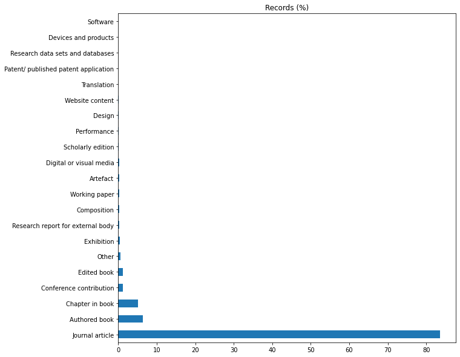
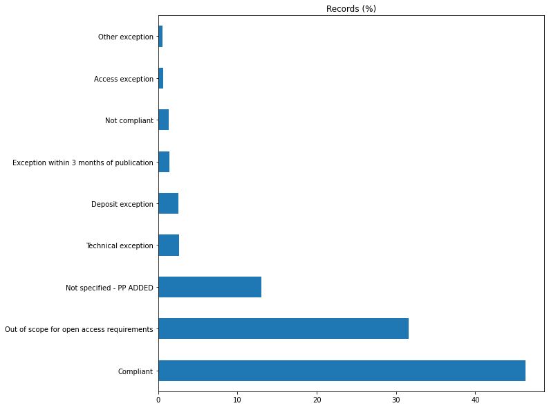
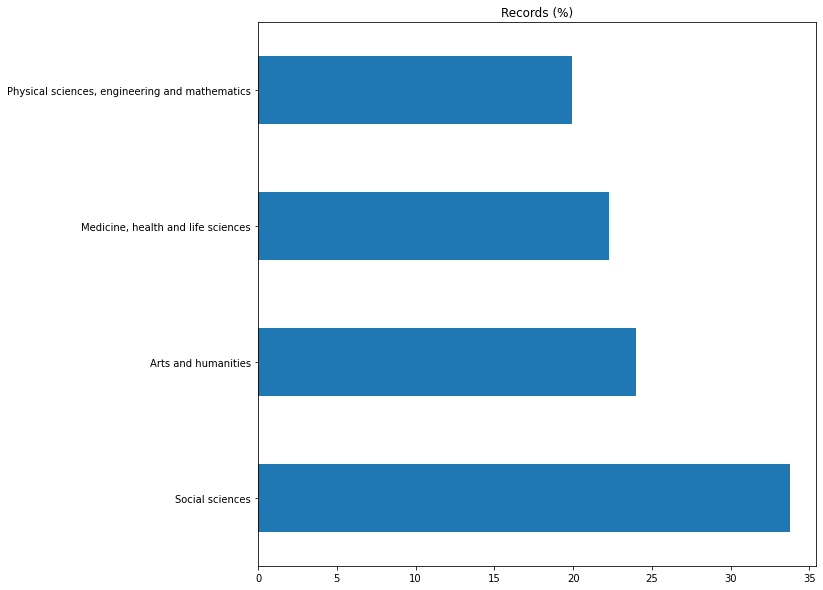

# Explorations of the REF 2021 submission data

Notes
- `Not specified - PP ADDED` is a category added during pre-processing to all string fields to replace missing values
- software terms: `computation`

## `Outputs` data

#### All records

    Read data/processed/Outputs_ppreprocessed.csv.gz: 185354 records
    
                                          Records  Records (%)
    Output type name                                          
    Journal article                        154826        83.53
    Authored book                           11801         6.37
    Chapter in book                          9475         5.11
    Conference contribution                  2272         1.23
    Edited book                              2135         1.15
    Other                                    1146         0.62
    Exhibition                                751         0.41
    Research report for external body         431         0.23
    Composition                               430         0.23
    Working paper                             390         0.21
    Artefact                                  378         0.20
    Digital or visual media                   360         0.19
    Scholarly edition                         329         0.18
    Performance                               312         0.17
    Design                                    119         0.06
    Website content                            67         0.04
    Translation                                38         0.02
    Patent/ published patent application       37         0.02
    Research data sets and databases           31         0.02
    Devices and products                       14         0.01
    Software                                   11         0.01

    

    

    
                                               Records  Records (%)
    Open access status                                             
    Compliant                                    85913        46.35
    Out of scope for open access requirements    58482        31.55
    Not specified - PP ADDED                     24174        13.04
    Technical exception                           4879         2.63
    Deposit exception                             4748         2.56
    Exception within 3 months of publication      2581         1.39
    Not compliant                                 2401         1.30
    Access exception                              1166         0.63
    Other exception                               1010         0.54

    

    

#### Records with `Output type` as _Software_

    Read data/processed/subsets/Outputs_ppreprocessed_type_software.csv.gz: 11 records
    
                              Records  Records (%)
    Open access status                            
    Not specified - PP ADDED       11       100.00
    
                              Records  Records (%)
    Interdisciplinary                             
    Not specified - PP ADDED        8        72.73
    Yes                             3        27.27
    
                                    Records  Records (%)
    Institution name                                    
    University College London             2        18.18
    University of Exeter                  2        18.18
    University of Ulster                  1         9.09
    Leeds Beckett University              1         9.09
    The University of Manchester          1         9.09
    University of Edinburgh               1         9.09
    Heriot-Watt University                1         9.09
    University of Cambridge               1         9.09
    University of the Arts, London        1         9.09
    
                                                    Records  Records (%)
    Main panel name                                                     
    Arts and humanities                                   6        54.55
    Social sciences                                       3        27.27
    Physical sciences, engineering and mathematics        2        18.18
    
                              Records  Records (%)
    Citations applicable                          
    Not specified - PP ADDED        9        81.82
    Yes                             2        18.18
    
                               Records  Records (%)
    Supplementary information                      
    Not specified - PP ADDED        11       100.00

#### Records with software terms in `Title`

    Read data/processed/subsets/Outputs_ppreprocessed_title_software_terms.csv.gz: 337 records
    
                             Records  Records (%)
    Output type name                             
    Journal article              322        95.55
    Conference contribution        9         2.67
    Authored book                  3         0.89
    Chapter in book                2         0.59
    Working paper                  1         0.30
    
                                               Records  Records (%)
    Open access status                                             
    Compliant                                      190        56.38
    Out of scope for open access requirements      111        32.94
    Not specified - PP ADDED                         8         2.37
    Deposit exception                                6         1.78
    Technical exception                              6         1.78
    Not compliant                                    5         1.48
    Other exception                                  4         1.19
    Access exception                                 4         1.19
    Exception within 3 months of publication         3         0.89
    
                              Records  Records (%)
    Interdisciplinary                             
    Not specified - PP ADDED      285        84.57
    Yes                            52        15.43
    
                                                    Records  Records (%)
    Main panel name                                                     
    Physical sciences, engineering and mathematics      223        66.17
    Medicine, health and life sciences                   66        19.58
    Social sciences                                      33         9.79
    Arts and humanities                                  15         4.45
    
                                                                       Records  Records (%)
    Institution name                                                                       
    University of Oxford                                                    19         5.64
    Imperial College of Science, Technology and Medicine                    16         4.75
    University College London                                               15         4.45
    The University of Leeds                                                 13         3.86
    University of Cambridge                                                 12         3.56
    University of Southampton                                               11         3.26
    The University of Lancaster                                             11         3.26
    University of Edinburgh                                                  9         2.67
    University of Bristol                                                    9         2.67
    University of Durham                                                     8         2.37
    Cardiff University / Prifysgol Caerdydd                                  8         2.37
    The University of Bath                                                   7         2.08
    University of Newcastle upon Tyne                                        7         2.08
    University of Sussex                                                     6         1.78
    University of Glasgow                                                    6         1.78
    The University of Birmingham                                             6         1.78
    The University of Liverpool                                              6         1.78
    Loughborough University                                                  6         1.78
    The University of Warwick                                                6         1.78
    University of Greenwich                                                  6         1.78
    Swansea University / Prifysgol Abertawe                                  5         1.48
    The University of Kent                                                   5         1.48
    Brunel University London                                                 5         1.48
    The University of Manchester                                             5         1.48
    University of Ulster                                                     5         1.48
    The University of Sheffield                                              4         1.19
    University of St Andrews                                                 4         1.19
    The University of Huddersfield                                           4         1.19
    Coventry University                                                      4         1.19
    University of Nottingham, The                                            4         1.19
    Oxford Brookes University                                                4         1.19
    Birkbeck College                                                         3         0.89
    The University of Leicester                                              3         0.89
    Robert Gordon University                                                 3         0.89
    Glasgow Caledonian University                                            3         0.89
    The University of Bradford                                               3         0.89
    Nottingham Trent University                                              3         0.89
    City, University of London                                               3         0.89
    Goldsmiths' College                                                      3         0.89
    University of Hertfordshire                                              3         0.89
    Cranfield University                                                     3         0.89
    University of the West of England, Bristol                               3         0.89
    University of Lincoln                                                    3         0.89
    King's College London                                                    3         0.89
    University of Strathclyde                                                3         0.89
    Queen Mary University of London                                          3         0.89
    Sheffield Hallam University                                              3         0.89
    The University of Surrey                                                 3         0.89
    University of Stirling                                                   3         0.89
    Aston University                                                         2         0.59
    The University of Hull                                                   2         0.59
    Heriot-Watt University                                                   2         0.59
    Bournemouth University                                                   2         0.59
    Abertay University                                                       2         0.59
    University of the West of Scotland                                       2         0.59
    University of Exeter                                                     2         0.59
    University of Plymouth                                                   2         0.59
    University of Brighton                                                   2         0.59
    Wrexham Glyndŵr University / Prifysgol Glyndŵr Wrecsam                   2         0.59
    Edinburgh Napier University                                              2         0.59
    Royal Holloway and Bedford New College                                   2         0.59
    University of Northumbria at Newcastle                                   2         0.59
    Harper Adams University                                                  1         0.30
    St. George's Hospital Medical School                                     1         0.30
    Birmingham City University                                               1         0.30
    University of York                                                       1         0.30
    The University of Westminster                                            1         0.30
    University of Chester                                                    1         0.30
    Queen's University of Belfast                                            1         0.30
    The University of Essex                                                  1         0.30
    The University of Reading                                                1         0.30
    University of Northampton, The                                           1         0.30
    University of East London                                                1         0.30
    De Montfort University                                                   1         0.30
    Anglia Ruskin University Higher Education Corporation                    1         0.30
    The Open University                                                      1         0.30
    Middlesex University                                                     1         0.30
    University of Derby                                                      1         0.30
    Staffordshire University                                                 1         0.30
    Cardiff Metropolitan University / Prifysgol Metropolitan Caerdydd        1         0.30
    University of Wolverhampton                                              1         0.30
    Manchester Metropolitan University                                       1         0.30
    University of the Arts, London                                           1         0.30

## `ImpactCaseStudies` data

#### All records

    Read data/processed/ImpactCaseStudies_ppreprocessed.csv.gz: 6362 records
    
                                                    Records  Records (%)
    Main panel name                                                     
    Social sciences                                    2146        33.73
    Arts and humanities                                1528        24.02
    Medicine, health and life sciences                 1419        22.30
    Physical sciences, engineering and mathematics     1268        19.93

    

    

#### Records with software terms in `Title` and `Summary`

    Read data/processed/subsets/ImpactCaseStudies_ppreprocessed_title_summary_software_terms.csv.gz: 48 records
    
                                                    Records  Records (%)
    Main panel name                                                     
    Physical sciences, engineering and mathematics       38        79.17
    Medicine, health and life sciences                    5        10.42
    Social sciences                                       4         8.33
    Arts and humanities                                   1         2.08
    
                                                          Records  Records (%)
    Institution name                                                          
    University of Oxford                                        4         8.33
    Imperial College of Science, Technology and Medicine        4         8.33
    University College London                                   3         6.25
    The University of Reading                                   3         6.25
    Queen Mary University of London                             3         6.25
    King's College London                                       3         6.25
    University of Durham                                        2         4.17
    University of Stirling                                      2         4.17
    Manchester Metropolitan University                          2         4.17
    Swansea University / Prifysgol Abertawe                     2         4.17
    University of Sussex                                        1         2.08
    University of St Andrews                                    1         2.08
    The University of Liverpool                                 1         2.08
    Oxford Brookes University                                   1         2.08
    Coventry University                                         1         2.08
    University of Bristol                                       1         2.08
    University of Dundee                                        1         2.08
    Liverpool John Moores University                            1         2.08
    The University of Manchester                                1         2.08
    De Montfort University                                      1         2.08
    Bangor University / Prifysgol Bangor                        1         2.08
    University of the West of Scotland                          1         2.08
    University of Chester                                       1         2.08
    University of Glasgow                                       1         2.08
    Cardiff University / Prifysgol Caerdydd                     1         2.08
    University of Nottingham, The                               1         2.08
    University of Edinburgh                                     1         2.08
    University of South Wales / Prifysgol De Cymru              1         2.08
    University of Strathclyde                                   1         2.08
    University of Portsmouth                                    1         2.08
    
    Titles of impact case studies with software terms:
    
    University College London, Physical sciences, engineering and mathematics:
     Application of experimental and computational methods for improved performance of industrial catalytic systems and processes
    
    Imperial College of Science, Technology and Medicine, Medicine, health and life sciences:
     Commercial impact of Phyre: A resource for computational modelling of the 3D structure of proteins
    
    University of Strathclyde, Physical sciences, engineering and mathematics:
     Developments in digital marketing through computational analysis of dynamic social media networks.
    
    University of Stirling, Physical sciences, engineering and mathematics:
     Driving rural economic and environmental sustainability through data driven, computational models
    
    University of Oxford, Physical sciences, engineering and mathematics:
     Efficient adjoint sensitivities in computational finance
    
    University of South Wales / Prifysgol De Cymru, Physical sciences, engineering and mathematics:
     Enhancing computational models for weather and climate forecasting
    
    University of Edinburgh, Physical sciences, engineering and mathematics:
     Particle Physics computations driving the Computing Industry: Intel and IBM high-performance computing and machine learning
    
    University of Nottingham, The, Social sciences:
     Reducing food waste and food insecurity through computational social science
    
    Manchester Metropolitan University, Arts and humanities:
     A Methodology for Complex Sustainable Futures: Applying disruptive technologies to urban transformation
    
    Cardiff University / Prifysgol Caerdydd, Physical sciences, engineering and mathematics:
     A new blockchain method to improve logistics in national UK defence, and global industries
    
    University College London, Medicine, health and life sciences:
     AbYsis: Tools and resources accelerating development of antibody-based drugs
    
    University of Oxford, Social sciences:
     Addressing the Harms of Computational Propaganda on Democracy
    
    Swansea University / Prifysgol Abertawe, Physical sciences, engineering and mathematics:
     BSMBench: an open source tool for robust measurement of the performance of supercomputing systems
    
    University of Durham, Physical sciences, engineering and mathematics:
     CASTEP: A materials modelling code with wide ranging industrial and academic applications and commercial success
    
    University of Glasgow, Physical sciences, engineering and mathematics:
     Computational fluid dynamics changes aircraft policy guidelines, increases airport capacity and delivers new capability to industry engineers
    
    University of Oxford, Physical sciences, engineering and mathematics:
     Computational Tools for the Discovery, Development and Design of Antibody Therapeutics
    
    King's College London, Social sciences:
     Developing New Forecasting Models at the Bank of England and the European Central Bank
    
    University of Chester, Physical sciences, engineering and mathematics:
     Digital Control and Simulation of Complex Energy Systems (CES)
    
    The University of Manchester, Physical sciences, engineering and mathematics:
     Driving the industrial biotechnology revolution: cheaper and more sustainable chemical manufacturing through enzyme discovery, engineering and scale-up
    
    University of the West of Scotland, Physical sciences, engineering and mathematics:
     Efficient and Robust Signal/Image Processing and Machine Learning Methods for Real Life Challenging Scenarios
    
    Bangor University / Prifysgol Bangor, Social sciences:
     Enabling effective and fast decision-making in organisations: forecasting with the Theta Method
    
    De Montfort University, Physical sciences, engineering and mathematics:
     Enhancing Pilot Training and Flight Safety Through Improved Aerodynamic Modelling and Prediction of Nonlinear Flight Dynamics
    
    The University of Liverpool, Medicine, health and life sciences:
     Food Policies & Disease Prevention – the IMPACT model
    
    Imperial College of Science, Technology and Medicine, Physical sciences, engineering and mathematics:
     General-purpose Bayesian inference software has revolutionized data science globally
    
    Liverpool John Moores University, Medicine, health and life sciences:
     ICS5: Computational Models for Safe Cosmetics
    
    King's College London, Physical sciences, engineering and mathematics:
     Implementation of Deep Neural Networks for Option Pricing in the finance sector
    
    The University of Reading, Physical sciences, engineering and mathematics:
     Improved accuracy of weather forecasting internationally through advanced use of observational data
    
    Swansea University / Prifysgol Abertawe, Physical sciences, engineering and mathematics:
     Improved modelling capability for aerospace and other industries through application of an unstructured mesh technology
    
    Queen Mary University of London, Physical sciences, engineering and mathematics:
     Improving Mental Healthcare through a Tool for Effective Clinical Communication
    
    University of Sussex, Physical sciences, engineering and mathematics:
     Improving processes for generating flood risk assessments, used by insurance and other sectors
    
    University of St Andrews, Physical sciences, engineering and mathematics:
     More effective teaching of advanced mathematics through new algorithms incorporated in open source mathematical software
    
    The University of Reading, Physical sciences, engineering and mathematics:
     New computer systems for exploiting big environmental data for worldwide usability, model and policy development
    
    University of Durham, Physical sciences, engineering and mathematics:
     P&G – Durham Physics Partnership
    
    Imperial College of Science, Technology and Medicine, Physical sciences, engineering and mathematics:
     Quantum optics research influencing Government policy and investment in Quantum Technologies
    
    The University of Reading, Physical sciences, engineering and mathematics:
     Research supporting the use of climate emission metrics in policy making
    
    University College London, Physical sciences, engineering and mathematics:
     Rheological model for optimized manufacturing of oral healthcare products
    
    Oxford Brookes University, Physical sciences, engineering and mathematics:
     Robust and reliable digitalisation of the automotive industry: improvements in 3D CFD modelling of particulate matter emissions
    
    University of Oxford, Physical sciences, engineering and mathematics:
     Rolls-Royce HYDRA CFD code for gas turbine engine design
    
    Coventry University, Medicine, health and life sciences:
     Safer Heart Therapies: Improving Drug Development and Patient Outcomes with InoCardia Ltd
    
    Manchester Metropolitan University, Physical sciences, engineering and mathematics:
     Sandscaping and seawalls: wave modelling protects towns and critical national infrastructure from costly floods and damage
    
    University of Stirling, Physical sciences, engineering and mathematics:
     Saving time and money through industrial scheduling and optimisation algorithms
    
    University of Bristol, Physical sciences, engineering and mathematics:
     Securing Data During Computation: Turning Theory into Practice
    
    University of Dundee, Physical sciences, engineering and mathematics:
     Software development for measuring dental clinical outcomes
    
    Queen Mary University of London, Physical sciences, engineering and mathematics:
     State-of-the-art Algorithms for Modelling Radiation Damage Change International Policy on Managing Nuclear Safety
    
    King's College London, Physical sciences, engineering and mathematics:
     Stochastic modelling of pension assets and liabilities influences UK Government’s pension policies, and the work of financial institutions and charities
    
    Imperial College of Science, Technology and Medicine, Physical sciences, engineering and mathematics:
     Structural Integrity of Aero-engine Bladed Discs
    
    Queen Mary University of London, Physical sciences, engineering and mathematics:
     The Infer Tool for Automatic Verification of Memory Violations in Software Systems
    
    University of Portsmouth, Physical sciences, engineering and mathematics:
     UoP11DREAM: Robotics research improves support for autism spectrum disorder and stroke patients
    

